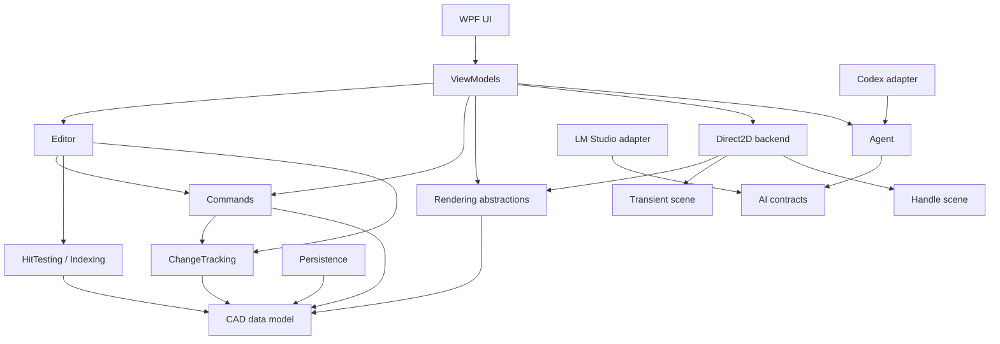

# Direct2dCad

[中文](README.md) | [日本語](README.ja.md) | English

## Overview

Direct2dCad is an experimental desktop CAD editor built with WPF, Direct2D, and DirectWrite. It explores a maintainable CAD editing architecture, Direct2D resource management, and responsive rendering for large drawings.

Main capabilities:

- Create and edit common CAD entities, layers, styles, fills, hatch patterns, text, images, OLE objects, blocks, layouts, and model-space viewports.
- Select entities by click or window, cycle through overlapping entities, use selection filters, and edit multiple entities together.
- Move, scale, rotate, and edit entities through grip/handle interaction.
- Use single or grouped undo/redo for document commands and editor operations.
- Copy and paste entities across documents, including block references and their dependent block definitions.
- Render with Direct2D resource caching, change tracking, dirty rectangles, transient previews, selection overlays, handles, LOD, and viewport snapshots.
- Use a WPF CAD canvas with pan, zoom, fit, grid and snap settings, origin markers, layers, properties, search, terminal, and configurable radial menus.
- Connect LM Studio or Codex to query drawings and execute undoable CAD operations through an Agent toolset.
- Save and load `.d2cad` documents, with Chinese, Japanese, and English UI resources.

## Demos and design

- [Basic editing]
  
https://github.com/user-attachments/assets/53180795-5870-42c7-9148-5586ca1bfd6b


https://github.com/user-attachments/assets/5515d18a-1d88-4851-a8d9-54f10bdee5ed

- [Blocks demo]
  
https://github.com/user-attachments/assets/45c5e49e-c59a-4f80-aaf3-de8ec7680310

- [Layouts demo]

https://github.com/user-attachments/assets/847600ec-c82e-4ed0-82d9-443d59339906

- [OLE objects demo]

https://github.com/user-attachments/assets/ab1f207f-48c2-40a8-b698-496c6077a0a3

- [CAD Terminal demo]

https://github.com/user-attachments/assets/fc7236e2-93e8-44f3-800d-b00bfd54f761

- [LM Studio AI demo]

https://github.com/user-attachments/assets/ebb26f5b-63a1-4159-a101-69da56e776a7


https://github.com/user-attachments/assets/63a6763b-b63c-4a29-a499-cadb94242509

- [Figma design](https://www.figma.com/board/wZWqWgQ9dd1p4KQVBakqmS/Direct2dCad?node-id=52-299&t=jXGAkAOnYQmodsTk-4)

## Solution structure

| Area | Projects |
|---|---|
| CAD model | `Direct2dCad.Db`, `Direct2dCad.ChangeTracking` |
| Commands and editing | `Direct2dCad.Commands`, `Direct2dCad.CommandLine`, `Direct2dCad.Editor` |
| AI and Agent | `Direct2dCad.AI.Contracts`, `Direct2dCad.AI.LmStudio`, `Direct2dCad.Agent`, `Direct2dCad.Agent.Codex` |
| Query and storage | `Direct2dCad.HitTesting`, `Direct2dCad.Indexing`, `Direct2dCad.IO` |
| Rendering | `Direct2dCad.Rendering`, `Direct2dCad.Rendering.Transient`, `Direct2dCad.Rendering.Handles`, `Direct2dCad.Rendering.Direct2D` |
| Client common and language | `Direct2dCad.Client.Common`, `Direct2dCad.Lang` |
| ViewModels | `Direct2dCad.ViewModels.Abstractions`, `Direct2dCad.ViewModels.Services`, `Direct2dCad.ViewModels` |
| WPF | `Direct2dCad.wpf.Controls`, `Direct2dCad.wpf` |

`Direct2dCad.ViewModels.Services` contains platform abstractions and UI-independent collaborators. WPF implementations live under `Direct2dCad.wpf/Services`. MessagePipe is used for communication between distant ViewModels.

## Architecture



The dependency direction is intentional:

- `Direct2dCad.Db` is the source of truth and does not depend on WPF, the editor, or Direct2D.
- `Direct2dCad.ChangeTracking` describes document changes without depending on commands or rendering.
- `Direct2dCad.Rendering` defines renderer contracts; `Direct2dCad.Rendering.Direct2D` is the Direct2D implementation.
- `Direct2dCad.Rendering.Transient` and `Direct2dCad.Rendering.Handles` describe scene data, not document commands.
- `Direct2dCad.Commands` changes documents and returns change sets; the editor, index, and renderer react to those change sets.
- Agent tools use the same command and editor paths as the UI, so AI edits participate in undo/redo and resource invalidation.

## Core components

### CAD model and change tracking

`Direct2dCad.Db` defines `CadDocument`, layers, blocks, layouts, entities, styles, fills, hatches, view settings, grid/origin settings, geometry types, and strongly typed IDs. Supported entities include line, circle, arc, ellipse, ellipse arc, rectangle, polyline, polygon, spline, TrueType text, shape text, image, OLE, block reference, and viewport-related objects.

`Direct2dCad.ChangeTracking` defines `CadDocumentChangeSet` and change categories such as geometry, appearance, fill, visibility, layer, and draw order. It is the neutral contract between commands, editor, indexing, and rendering.

### Commands and editor

`Direct2dCad.Commands` implements CRUD, property editing, layer operations, origin operations, block operations, copy/paste, and grouped commands. Single-command and batch undo/redo behavior is configurable at the command manager level.

`Direct2dCad.Editor` coordinates command execution, selection, hit testing, spatial indexes, viewport operations, and rendering invalidation. It also updates geometry, brush, text, hatch, and image/OLE resources after document changes.

`Direct2dCad.CommandLine` provides a UI-independent command protocol with aliases, command history, completion, coordinate input, undo/redo, fit, selection, copy/paste, and entity drawing modes. It is shared by the WPF Terminal and Agent tools.

### Query and indexing

`Direct2dCad.HitTesting` handles click selection, window selection, selection cycling, line weight, text bounds, block transforms, and layer visibility/locking rules.

`Direct2dCad.Indexing` maintains bounds and spatial candidates for hit testing, window selection, dirty-region planning, and viewport culling. Entity changes update the index through change tracking.

### Rendering

`Direct2dCad.Rendering` defines renderer contracts, viewport data, render options, dirty rectangles, invalidation, geometry resource management, and the WPF image-source bridge.

`Direct2dCad.Rendering.Direct2D` manages Direct2D/DirectWrite resources and draws the background, grid, origin, document entities, transient previews, selection overlays, and handles. Resources are created or updated in response to entity changes and reused during ordinary drawing. Device-loss recovery recreates device resources and schedules a full redraw.

`Direct2dCad.Rendering.Transient` contains temporary drawing data: drawing previews, selection windows, copy/paste previews, snap markers, construction lines, and measurement text. It follows the same stroke, fill, hatch, line-weight, layer-style, and LOD rules as normal entities, with auxiliary graphics added separately.

`Direct2dCad.Rendering.Handles` contains selected-entity outlines, grips, handles, their positions, types, sizes, and hit-test data. Commands perform the actual document changes.

### WPF and user settings

`Direct2dCad.Client.Common` stores user preferences such as selection colors, crossing-window colors, grip colors, anti-aliasing, LOD, viewport preview, radial-menu profiles, and AI preferences. These settings are separate from document data.

`CadDocument` and `CadViewSettings` store drawing-specific settings such as background color, grid spacing/style, snap behavior, origin marker, layers, and drawing priority. These settings are saved in `.d2cad` files.

`Direct2dCad.ViewModels.Abstractions` contains lightweight canvas input contracts and binding enums. `Direct2dCad.ViewModels.Services` contains drawing, geometry, interaction, rendering, snapping, styling, text, and platform service boundaries. `Direct2dCad.ViewModels` provides document, editor-tab, properties, layers, search, selection-filter, terminal, AI, and settings ViewModels.

`Direct2dCad.wpf.Controls` contains reusable controls. `Direct2dCad.wpf` provides the application shell, `CadCanvas`, AvalonDock toolboxes, property panels, settings dialogs, WPF services, and Direct3D image hosting.

### AI and Agent

`Direct2dCad.AI.Contracts` defines provider-independent assistant, tool-call, tool-result, settings, and client contracts.

`Direct2dCad.AI.LmStudio` implements the OpenAI-compatible LM Studio client. Start LM Studio Local Server and load a tool-calling model; the default endpoint is `http://localhost:1234/v1`.

`Direct2dCad.Agent` manages conversation history, context budgets, tool execution, context compression, cancellation, and multi-turn orchestration.

`Direct2dCad.Agent.Codex` connects to the local Codex app-server through stdio JSON-RPC and exposes the same CAD toolset. It uses the local Codex CLI authentication and model configuration.

AI tools can query document IDs, active documents, entities, layers, blocks, and view state; create, modify, delete, save, open, activate, and close documents; and create entities with appearance and style settings. Every target document uses its own undo/redo batch.

## Canvas interaction

- Select mode prioritizes grip/handle hit testing.
- Click selection, crossing/window selection, Shift multi-selection, selection cycling, and `Ctrl+A`/`Alt+A` all operate on the active space.
- Grip dragging supports moving, scaling, rotating, and multi-entity editing.
- Releasing the mouse keeps a grip operation in preview; a subsequent left click commits it.
- Right or middle mouse is used for pan; there is no separate Pan tool mode.
- `Esc` returns to Select mode and clears drawing, selection-window, grip, and paste-preview state.
- `Enter` finishes multi-point drawing such as polyline, polygon, and spline.
- Mouse-wheel zoom keeps the cursor position and updates model/layout viewport state.

Current drawing modes include:

```text
Select, Line, Rectangle, CircleCenterRadius, CircleCenterDiameter,
CircleTwoPoint, CircleThreePoint,
ArcThreePoint, ArcStartCenterEnd, ArcStartCenterAngle, ArcStartCenterLength,
ArcStartEndAngle, ArcStartEndDirection, ArcStartEndRadius,
ArcCenterStartEnd, ArcCenterStartAngle, ArcCenterStartLength, ArcContinue,
EllipseCenter, EllipseAxisEnd, EllipseArc, Polyline, Polygon, Spline, Text,
SetOrigin
```

## Rendering and resource rules

- Entity create, update, delete, layer changes, and view changes produce a `CadDocumentChangeSet`.
- The editor updates selection, bounds, indexes, resources, and dirty regions from that change set.
- Geometry, brushes, text layouts, hatch resources, images, and OLE resources are reused and released according to ownership and usage.
- Draw order uses layer drawing priority, entity `ZIndex`, and insertion order.
- Layer-following color and line weight are resolved at draw time while the entity's own values remain editable and persisted.
- Fill and hatch use one fill color; hatch patterns do not add an unwanted background color.
- Dirty regions include old and new entity bounds, line weight, fills/hatches, handles, transient previews, grid, and overlays.
- Small or visually negligible entities may be skipped or simplified according to user-controlled LOD settings.

## Build and test

```powershell
dotnet build .\Direct2dCad.slnx
dotnet test .\Direct2dCad.slnx -m:1
```

## Performance benchmarks

`Direct2dCad.Benchmarks` uses BenchmarkDotNet. Run it in `Release` configuration on Windows x64 with a stable GPU driver:

`CacheEvictionBenchmarks` compares sorting-based eviction with a reusable priority queue for 128 / 1,024 candidates, measuring time and managed allocations without creating GPU resources.

`OwnerBoundsUpdateBenchmarks` compares a full bounds scan with incremental bounds-tree updates in 20,000 / 100,000-entity owners. `DirtyRegionBatchBenchmarks` measures conservative reduction of 512 / 20,000 dirty rectangles. `SelectionOverlayBenchmarks` also compares scene reuse with versioned selection-order reuse. Spatial count benchmarks include pending edits: counts correct the immutable tree using old/new bounds. Subsequent large-index rebuilds run on value snapshots in the background; initial builds and snapshot capture remain on the calling thread. The index is not a concurrent read/write collection.

```powershell
dotnet run -c Release --project .\Direct2dCad.Benchmarks\Direct2dCad.Benchmarks.csproj -- --list flat
dotnet run -c Release --project .\Direct2dCad.Benchmarks\Direct2dCad.Benchmarks.csproj -- --smoke --filter "*SpatialIndexBenchmarks*"
dotnet run -c Release --project .\Direct2dCad.Benchmarks\Direct2dCad.Benchmarks.csproj -- --filter "*Direct2DRenderingBenchmarks*"
```

The benchmark suite covers spatial indexing, selection overlays, dirty regions, Direct2D rendering and resource updates, complex scenes, document IO, and layout/model viewport rendering. Use `--document "C:\Drawings\large.d2cad"` for a real document in the IO benchmarks. OLE performance depends on the external COM server and is intentionally kept out of the default reproducible run.
