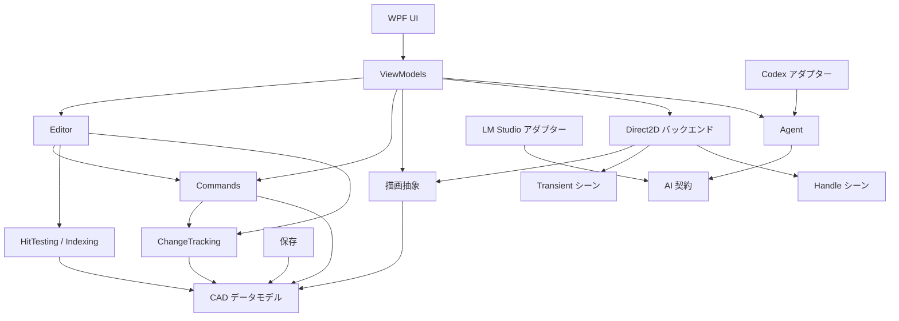

# Direct2dCad

[中文](README.md) | 日本語 | [English](README.en.md)

## 概要

Direct2dCad は、WPF、Direct2D、DirectWrite で作成しているデスクトップ CAD エディターの実験プロジェクトです。保守しやすい CAD 編集アーキテクチャ、大規模図面向けの Direct2D リソース管理、高速な描画を検証しています。

主な機能:

- 線、円、円弧、楕円、矩形、ポリライン、ポリゴン、スプライン、文字、画像、OLE、ブロック、レイアウト、モデル空間ビューポートなどの作成と編集。
- クリック選択、窓選択、重なったエンティティの選択サイクル、選択フィルター、複数エンティティ編集。
- grip / handle による移動、拡大縮小、回転、編集。
- 単一コマンドと一括コマンドに対応した undo / redo。
- ブロック参照と依存するブロック定義を含む、ドキュメント間のコピーと貼り付け。
- Direct2D リソースキャッシュ、変更追跡、dirty rectangle、Transient プレビュー、選択オーバーレイ、handle、LOD、ビューポートスナップショット。
- WPF の CAD キャンバス、pan、zoom、fit、グリッド、スナップ、原点マーカー、レイヤー、プロパティ、検索、Terminal、カスタマイズ可能なラジアルメニュー。
- LM Studio または Codex に接続し、図面を検索して undo 可能な CAD 編集を実行する Agent 機能。
- `.d2cad` の保存と読み込み、中国語・日本語・英語の UI リソース。

## デモとデザイン

- [基本操作]
  
https://github.com/user-attachments/assets/53180795-5870-42c7-9148-5586ca1bfd6b


https://github.com/user-attachments/assets/5515d18a-1d88-4851-a8d9-54f10bdee5ed

- [Block デモ]
  
https://github.com/user-attachments/assets/45c5e49e-c59a-4f80-aaf3-de8ec7680310

- [Layout デモ]

https://github.com/user-attachments/assets/847600ec-c82e-4ed0-82d9-443d59339906

- [OLE オブジェクト デモ]

https://github.com/user-attachments/assets/ab1f207f-48c2-40a8-b698-496c6077a0a3

- [CAD Terminal デモ]

https://github.com/user-attachments/assets/fc7236e2-93e8-44f3-800d-b00bfd54f761

- [LM Studio AI デモ]

https://github.com/user-attachments/assets/ebb26f5b-63a1-4159-a101-69da56e776a7


https://github.com/user-attachments/assets/63a6763b-b63c-4a29-a499-cadb94242509

- [Figma デザイン](https://www.figma.com/board/wZWqWgQ9dd1p4KQVBakqmS/Direct2dCad?node-id=52-299&t=jXGAkAOnYQmodsTk-4)

## ソリューション構成

| 分野 | プロジェクト |
|---|---|
| CAD モデル | `Direct2dCad.Db`, `Direct2dCad.ChangeTracking` |
| コマンドと編集 | `Direct2dCad.Commands`, `Direct2dCad.CommandLine`, `Direct2dCad.Editor` |
| AI と Agent | `Direct2dCad.AI.Contracts`, `Direct2dCad.AI.LmStudio`, `Direct2dCad.Agent`, `Direct2dCad.Agent.Codex` |
| 検索と保存 | `Direct2dCad.HitTesting`, `Direct2dCad.Indexing`, `Direct2dCad.IO` |
| 描画 | `Direct2dCad.Rendering`, `Direct2dCad.Rendering.Transient`, `Direct2dCad.Rendering.Handles`, `Direct2dCad.Rendering.Direct2D` |
| 共通クライアントと言語 | `Direct2dCad.Client.Common`, `Direct2dCad.Lang` |
| ViewModel | `Direct2dCad.ViewModels.Abstractions`, `Direct2dCad.ViewModels.Services`, `Direct2dCad.ViewModels` |
| WPF | `Direct2dCad.wpf.Controls`, `Direct2dCad.wpf` |

`Direct2dCad.ViewModels.Services` には、プラットフォーム抽象と UI に依存しない協調サービスを置いています。WPF 側の実装は `Direct2dCad.wpf/Services` にあり、離れた ViewModel 間の通信には MessagePipe を使います。

## アーキテクチャ



依存方向は次の方針で分けています。

- `Direct2dCad.Db` が図面データの source of truth であり、WPF、Editor、Direct2D に依存しません。
- `Direct2dCad.ChangeTracking` はコマンドと描画のどちらにも依存しない変更通知モデルです。
- `Direct2dCad.Rendering` は描画契約、`Direct2dCad.Rendering.Direct2D` はその Direct2D 実装です。
- `Transient` と `Handles` はシーンデータを扱い、ドキュメントコマンドは実行しません。
- `Commands` はドキュメントを変更して change set を返し、Editor、Indexing、Renderer がそれに反応します。
- Agent も UI と同じコマンド経路を使用するため、AI による変更も undo / redo とリソース更新の対象になります。

## 主要プロジェクト

### CAD モデル、変更追跡、コマンド

`Direct2dCad.Db` は `CadDocument`、レイヤー、ブロック、レイアウト、エンティティ、スタイル、塗りつぶし、ハッチ、表示設定、グリッド、原点、幾何型、強い型の ID を定義します。TrueType 文字と ShapeText、画像、OLE、ブロック参照も含みます。

`Direct2dCad.ChangeTracking` は `CadDocumentChangeSet` と、geometry、appearance、fill、visibility、layer、draw order などの変更分類を定義します。Commands、Editor、Indexing、Rendering の中立的な接続層です。

`Direct2dCad.Commands` は CRUD、プロパティ変更、レイヤー、原点、ブロック、コピー貼り付け、一括コマンドを実装します。単一 undo / redo と一括 undo / redo の扱いはコマンド管理設定で切り替えます。

`Direct2dCad.Editor` はコマンド実行、選択、命中判定、空間インデックス、viewport、描画無効化を調整し、ドキュメント変更後の geometry、brush、text、hatch、画像、OLE リソースも更新します。

### 検索、インデックス、描画

`Direct2dCad.HitTesting` はクリック選択、窓選択、選択サイクル、線幅、文字 bounds、ブロック変換、レイヤーの表示・ロック規則を扱います。

`Direct2dCad.Indexing` はエンティティ bounds と空間候補を管理し、命中判定、窓選択、dirty region、viewport のカリングに使われます。

`Direct2dCad.Rendering` は renderer、viewport、render options、複数 dirty rectangle、無効化、geometry resource manager、WPF image source bridge の契約を定義します。

`Direct2dCad.Rendering.Direct2D` は Direct2D / DirectWrite の geometry、brush、text layout、hatch などを管理し、背景、グリッド、原点、エンティティ、Transient、選択、handle を描画します。通常の描画中に毎回リソースを作らず、変更追跡に応じて作成、更新、解放します。デバイスロスト時はデバイスリソースを再構築して全体を再描画します。

`Direct2dCad.Rendering.Transient` は作図プレビュー、選択窓、コピー貼り付けプレビュー、snap marker、補助線、測定文字を保持します。通常のエンティティと同じ stroke、fill、hatch、line weight、layer style、LOD を使い、補助表示だけを追加します。

`Direct2dCad.Rendering.Handles` は選択枠、grip / handle の位置、種類、サイズ、命中判定用データを管理します。実際の変更は Editor / Commands が行います。

### WPF、設定、AI

`Direct2dCad.Client.Common` は選択色、窓選択色、grip 色、アンチエイリアス、LOD、viewport preview、ラジアルメニュー、AI などのユーザー設定を管理します。図面に保存される設定とは分離しています。

`CadDocument` と `CadViewSettings` は背景色、グリッド、スナップ、原点、レイヤー、描画優先度など図面固有の設定を保持し、`.d2cad` に保存します。

`Direct2dCad.ViewModels` と `Direct2dCad.ViewModels.Services` は、文書、エディタータブ、プロパティ、レイヤー、検索、選択フィルター、Terminal、AI、設定、描画、geometry、interaction、snapping、styling、text の ViewModel とサービスを提供します。

`Direct2dCad.wpf` は `CadCanvas`、AvalonDock toolbox、属性・レイヤー・検索・Terminal・AI・設定画面、WPF サービス、Direct3D image hosting を提供します。

`Direct2dCad.AI.Contracts` は共通の assistant、tool call、tool result、設定、client 契約を定義します。`Direct2dCad.AI.LmStudio` は OpenAI 互換の LM Studio クライアント、`Direct2dCad.Agent` は会話履歴、コンテキスト上限、ツール実行、キャンセル、複数ターンを管理します。`Direct2dCad.Agent.Codex` は stdio JSON-RPC でローカル Codex app-server に接続し、同じ CAD toolset を提供します。

AI は document ID、active document、エンティティ、レイヤー、ブロック、表示状態を検索でき、文書の作成、変更、削除、保存、開く、切り替え、名前変更、終了、スタイル付きエンティティ作成を実行できます。各ドキュメントの変更は独立した undo / redo batch になります。

## キャンバス操作

- Select モードでは grip / handle の命中判定を優先します。
- クリック選択、窓選択、Shift 複数選択、選択サイクル、`Ctrl+A` / `Alt+A` に対応します。
- grip のドラッグで移動、拡大縮小、回転、複数エンティティ編集を行います。
- マウスを離しても grip 操作はプレビュー状態を保ち、次の左クリックで確定します。
- 右ボタンまたは中ボタンで pan します。独立した Pan モードはありません。
- `Esc` は常に Select に戻り、作図、選択窓、grip、貼り付けプレビューを解除します。
- `Enter` は polyline、polygon、spline などの多点作図を確定します。
- マウスホイールで zoom し、カーソル位置を保ったまま model / layout viewport を更新します。

主な作図モード:

```text
Select, Line, Rectangle, CircleCenterRadius, CircleCenterDiameter,
CircleTwoPoint, CircleThreePoint,
ArcThreePoint, ArcStartCenterEnd, ArcStartCenterAngle, ArcStartCenterLength,
ArcStartEndAngle, ArcStartEndDirection, ArcStartEndRadius,
ArcCenterStartEnd, ArcCenterStartAngle, ArcCenterStartLength, ArcContinue,
EllipseCenter, EllipseAxisEnd, EllipseArc, Polyline, Polygon, Spline, Text,
SetOrigin
```

## 描画とリソース更新の方針

- エンティティ、レイヤー、表示設定の作成・変更・削除は `CadDocumentChangeSet` を生成します。
- Editor は change set に応じて選択、bounds、インデックス、リソース、dirty region を更新します。
- geometry、brush、text layout、hatch、画像、OLE は再利用し、所有者と使用状況に応じて解放します。
- 描画順は layer drawing priority、エンティティ `ZIndex`、追加順で決まります。
- layer に従う色や line weight は描画時に解決しますが、エンティティ自身の値は編集・保存できます。
- fill と hatch は同じ fill color を使い、不要な背景色は描画しません。
- dirty region は旧位置・新位置、線幅、fill / hatch、handle、Transient、グリッド、overlay を考慮します。
- 画面上で見えないほど小さいエンティティは、ユーザー設定の LOD に応じて省略または簡略化できます。

## ビルドとテスト

```powershell
dotnet build .\Direct2dCad.slnx
dotnet test .\Direct2dCad.slnx -m:1
```

## パフォーマンスベンチマーク

`Direct2dCad.Benchmarks` は BenchmarkDotNet を使います。Windows x64、安定した GPU ドライバー、`Release` 構成で実行してください。

```powershell
dotnet run -c Release --project .\Direct2dCad.Benchmarks\Direct2dCad.Benchmarks.csproj -- --list flat
dotnet run -c Release --project .\Direct2dCad.Benchmarks\Direct2dCad.Benchmarks.csproj -- --smoke --filter "*SpatialIndexBenchmarks*"
dotnet run -c Release --project .\Direct2dCad.Benchmarks\Direct2dCad.Benchmarks.csproj -- --filter "*Direct2DRenderingBenchmarks*"
```

ベンチマークは空間インデックス、選択 overlay、dirty region、Direct2D 描画とリソース更新、複雑なシーン、文書 IO、layout / model viewport を対象にします。IO ベンチマークで実ファイルを使う場合は `--document "C:\Drawings\large.d2cad"` を指定します。OLE は外部 COM サーバーに依存するため、再現性のある標準ベンチマークには含めていません。
