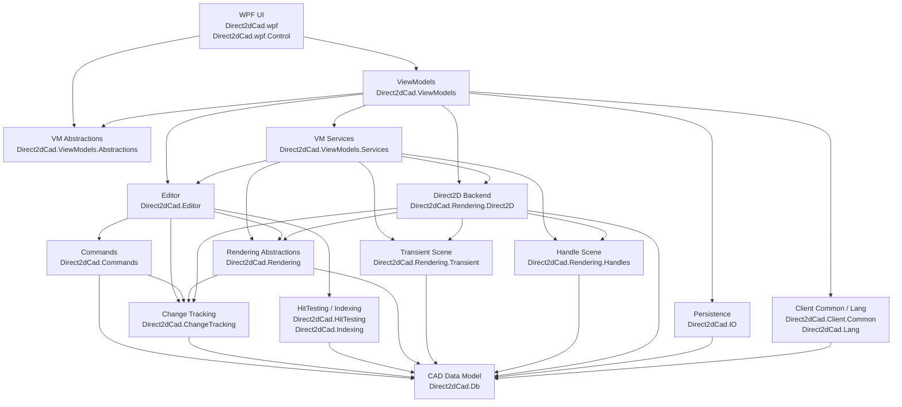

# Direct2dCad

Direct2dCad 是一个基于 Direct2D / DirectWrite / WPF 的 CAD 编辑器实验项目。当前重点是建立清晰的文档模型、命令 undo / redo、命中测试、索引、Direct2D 资源缓存、局部刷新、临时绘制预览、选中 handle / grip 操作，以及可扩展的 WPF ViewModel 架构。

Figma:

https://www.figma.com/board/wZWqWgQ9dd1p4KQVBakqmS/Direct2dCad?node-id=52-299&t=jXGAkAOnYQmodsTk-4

<video controls src="video.mp4" title="Title"></video>

## 当前项目

当前 `Direct2dCad.slnx` 中的项目如下：

```text
Direct2dCad.Db
Direct2dCad.ChangeTracking
Direct2dCad.Commands
Direct2dCad.Editor
Direct2dCad.HitTesting
Direct2dCad.Indexing
Direct2dCad.IO
Direct2dCad.Rendering
Direct2dCad.Rendering.Transient
Direct2dCad.Rendering.Handles
Direct2dCad.Rendering.Direct2D
Direct2dCad.Client.Common
Direct2dCad.Lang
Direct2dCad.ViewModels.Abstractions
Direct2dCad.ViewModels.Services
Direct2dCad.ViewModels
Direct2dCad.wpf.Control
Direct2dCad.wpf
```

View / ViewModel 之间的服务接口目前放在 `Direct2dCad.ViewModels/Services`，WPF 实现放在 `Direct2dCad/Services`。`Direct2dCad.ViewModels.Services` 是另一个项目，用来承载非 UI 的 ViewModel 业务服务，不是对话框、Snackbar 这类 View 服务实现。

## 架构分层



## 项目职责

### Direct2dCad.Db

核心 CAD 数据模型层，是图纸内容的 source of truth。

主要职责：

- 定义 `CadDocument`、Layer、Block、Entity、Style、FillStyle、HatchPattern 等核心模型。
- 定义 line、circle、arc、ellipse、ellipse arc、rectangle、polyline、spline、text、shape text、block reference 等实体。
- 定义文档级 `CadViewSettings`、grid、origin、layer drawing priority 等设置。
- 定义 `CadPointD`、`CadVectorD`、`CadRectD`、`CadMatrixD` 等几何类型。
- 定义 `EntityId`、`LayerId`、`BlockId`、`StyleId` 等强类型 ID。

原则：这里不依赖 editor、rendering、WPF，也不直接关心 Direct2D 资源。

### Direct2dCad.ChangeTracking

CAD 文档变更描述层。

主要职责：

- 定义 `CadDocumentChangeSet`。
- 定义实体、文档结构、视图设置等变更范围。
- 区分 geometry、appearance、fill、visibility、layer、draw order 等变更类型。
- 作为 Commands、Editor、Indexing、Rendering 之间的中性通知模型。
- 避免 `Direct2dCad.Rendering` / `Direct2dCad.Rendering.Direct2D` 直接依赖 `Direct2dCad.Commands`。

### Direct2dCad.Commands

CAD 文档命令层。

主要职责：

- 定义 `ICadCommand` 和命令执行结果。
- 实现实体 CRUD、属性修改、图层修改、原点设置等可 undo / redo 的文档命令。
- 支持单条命令和批量命令。
- 批量命令是否按组 undo / redo，应该由命令管理设置决定，而不是由渲染层决定。
- 命令执行后返回 `CadDocumentChangeSet`，用于索引、缓存和 Direct2D 资源更新。

### Direct2dCad.Editor

编辑应用层，协调文档、命令、选择、命中测试、索引、视口和渲染资源更新。

主要职责：

- 提供 `CadEditor` 作为编辑入口。
- 管理文档命令执行、undo、redo。
- 维护选择集。
- 连接 hit testing 和 spatial index。
- 发布 `CadDocumentChangeSet`。
- 根据实体变更通知 `ICadGeometryResourceManager` 更新或释放 geometry / brush / text 等资源。
- 提供 pan、zoom、fit 等视口命令。

### Direct2dCad.HitTesting

命中测试层。

主要职责：

- 在 CAD 世界坐标下执行点选、框选、反选候选判断。
- 命中测试需要考虑实体几何、line weight、文本外框或填充规则、block reference 变换等。
- 返回候选实体和命中信息，供 Editor / ViewModels 决定选择行为。

### Direct2dCad.Indexing

空间索引层。

主要职责：

- 记录实体 bounds。
- 按区域查询候选实体。
- 为框选、命中测试、局部刷新提供候选集合。
- 当实体 geometry / line weight / fill / visibility / layer 等影响 bounds 或可见性的属性改变时，需要通过变更通知更新索引。

### Direct2dCad.Rendering

渲染抽象层，不绑定具体 Direct2D 后端。

主要职责：

- 定义 `ICadRenderer`。
- 定义 `ICadGeometryResourceManager`。
- 定义 `CadViewport`、`CadRenderOptions`。
- 定义 `CadRenderInvalidation`、`CadScreenRect` 和多 dirty rect 局部刷新模型。
- 定义 `ID3D11ImageSource` 桥接接口，支持 WPF 图像源按 dirty rect 刷新。

### Direct2dCad.Rendering.Transient

临时绘制预览场景模型层。

主要职责：

- 定义绘制模式中的临时图形，例如 circle / arc / ellipse / line / polyline / spline / polygon / rectangle / text 预览。
- 定义选择框、复制粘贴预览、snap marker、绘制辅助线和测量文字。
- Transient 图形的 stroke、fill、hatch、line weight 应尽量与最终实体绘制一致。
- 不负责命令执行，也不把临时图形持久化到 `CadDocument`。

### Direct2dCad.Rendering.Handles

选中实体可视化 handle / grip 场景模型层。

主要职责：

- 定义选中外框、grip / handle 点、handle 场景。
- 提供 handle 场景构建和 handle 命中测试所需的数据模型。
- 描述 handle 的位置、类型、尺寸和显示方式。
- 不直接修改 `CadDocument`，实际移动或缩放由 Editor / Commands 完成。

### Direct2dCad.Rendering.Direct2D

Direct2D 渲染实现层，应该保留为独立项目。`Direct2dCad.Rendering` 是抽象；`Direct2dCad.Rendering.Direct2D` 是当前后端实现。

主要职责：

- 使用 Direct2D 绘制 `CadDocument`。
- 使用 DirectWrite 测量和绘制 TrueType 文本。
- 管理 Direct2D geometry / brush / text layout / hatch brush 等资源缓存。
- 绘制 background、grid、origin、实体、transient overlay、selection handle overlay。
- 支持 full render 和多 dirty rect 局部刷新。
- 处理 D3D11 / D3D9 shared surface 与 WPF `D3DImage` 交互。
- 在 `EndDraw` 出现可恢复设备失败时重建设备资源并触发全量重绘。

原则：绘制时不应该临时创建所有实体资源；实体创建、修改、删除时应通过 change tracking 驱动资源创建、更新和释放。特殊情况下可以延迟创建，但不能让正常绘制路径变成主要资源构造路径。

### Direct2dCad.IO

文件读写层。

主要职责：

- 保存和读取 `CadDocument`。
- 定义 `.d2cad` 文件容器和 section。
- 支持 section 级版本迁移。
- 支持读取单独 section，例如只读取 settings。
- 序列化文档级 view settings、layer、style、fill / hatch、origin、entity 等内容。

### Direct2dCad.Client.Common

客户端通用模型与用户设置层。

主要职责：

- 定义 `CadUserSettings`。
- 定义用户级渲染和交互偏好，例如选中颜色、选择框颜色、grip 颜色、是否开启抗锯齿等。
- 提供 enum description / localization 相关辅助。
- 明确区分用户偏好和图纸文档内容。

设置边界：

- `CadDocument` / `CadViewSettings` 保存与图纸相关的内容，例如背景、网格、原点、图层、绘制优先级。这些应该随 `.d2cad` 保存。
- `CadUserSettings` 保存与当前用户相关的偏好，例如选中颜色、选择框颜色、handle 颜色、抗锯齿开关。这些不应该写入图纸文件。

### Direct2dCad.Lang

多语言资源层。

主要职责：

- 管理 resx 语言资源。
- 提供 `LangKeys` 和 `Strings` 资源访问。
- 支持 WPF 中的 `I18N` XAML 绑定。
- 当前 UI 文本应优先通过 Lang 资源绑定，不应在 XAML 中散落硬编码文本。

### Direct2dCad.ViewModels.Abstractions

WPF / ViewModel 共享的轻量抽象层。

主要职责：

- 定义 `CadCanvasToolMode`。
- 定义画布输入结果、光标类型、鼠标按钮等输入 DTO。
- 定义 WPF/XAML 需要直接绑定的 ViewModel enum。
- 避免 WPF 项目为了绑定 enum 而依赖重型 ViewModel 服务实现。

### Direct2dCad.ViewModels.Services

非 UI 的 ViewModel 业务服务层。它用于把 `CadDocumentViewModel` 中的绘制、交互、几何、渲染协调等职责拆出来。

主要职责：

- Drawing：绘制状态、绘制点击处理、绘制实体创建、绘制预览、绘制默认样式。
- Geometry：绘制预览和 grip drag 相关几何构造。
- Interactions：pan、selection window、copy / paste、grip drag、viewport 初始化等交互控制器。
- Rendering：overlay scene 协调、render resource attach/detach、render invalidation 计算。
- Snapping：鼠标吸附逻辑。
- Styling：预览样式、layer-following 样式解析。
- Text：文本测量服务，隔离 DirectWrite 测量能力对 ViewModel 的影响。

### Direct2dCad.ViewModels

WPF ViewModel 层。

主要职责：

- 定义 `MainViewModel`、`EditorTabViewModel`、`CadDocumentViewModel`。
- 定义 folder explorer、layer toolbox、entity property toolbox 及各实体属性面板 VM。
- 绑定绘制模式、选择状态、图层、实体属性、用户设置和文档设置。
- 协调 transient scene、handle scene 和 `Direct2DImageRenderHost`。
- 定义 View / ViewModel 服务接口，例如 file dialog、dialog、snackbar、theme、culture、user settings、toolbox icons。

`CadDocumentViewModel` 的方向：只保留画布输入协调、命令入口和状态聚合。绘制预览、grip drag、snapping、render invalidation、文本测量等细分逻辑应继续放到 `Direct2dCad.ViewModels.Services`。

### Direct2dCad.wpf.Control

WPF 控件库项目。当前项目文件路径是 `Direct2dCad.Control/Direct2dCad.wpf.Control.csproj`。

主要职责：

- 放可复用 WPF 控件。
- 不依赖业务项目。

### Direct2dCad.wpf

WPF 应用层。

主要职责：

- 提供 WPF 启动入口、`MainWindow`、`CadCanvas`。
- 提供 Ribbon、StatusBar、FolderExplorer、LayerToolbox、EntityProperties 等 View。
- 实现 `Direct2dCad.ViewModels/Services` 中定义的对话框、Snackbar、文件选择、主题、语言、用户设置、图标等服务。
- 承载 `D3D11ImageSource` / `D3DImage`。
- 通过依赖注入装配 ViewModel 和 WPF 服务。

## 画布交互规则

当前画布交互由 `CadCanvas` 转换 WPF 输入，再交给 `CadDocumentViewModel` 处理。

核心规则：

- 左键在 Select 模式下优先命中 grip / handle；命中后进入移动或缩放预览状态。
- grip / handle 拖动时，松开鼠标不提交、不退出状态，只释放鼠标捕获并继续显示预览。
- grip / handle 拖动状态下再次左键点击，才提交移动或缩放命令。
- 右键或中键用于 pan，不需要单独的 Pan 工具模式。
- `Esc` 在任何状态下都回到 `Select` 模式，并清理绘制状态、选择框、grip drag、paste preview 等临时交互状态。
- `Enter` 用于完成当前多点绘制，例如 polyline、polygon、spline 等。
- 鼠标滚轮执行 zoom，并保留选中 handle overlay 的正确显示。

当前绘制模式包括：

```text
Select
Line
Rectangle
CircleCenterRadius
CircleCenterDiameter
CircleTwoPoint
CircleThreePoint
ArcThreePoint
ArcStartCenterEnd
ArcStartCenterAngle
ArcStartCenterLength
ArcStartEndAngle
ArcStartEndDirection
ArcStartEndRadius
ArcCenterStartEnd
ArcCenterStartAngle
ArcCenterStartLength
ArcContinue
EllipseCenter
EllipseAxisEnd
EllipseArc
Polyline
Polygon
Spline
Text
SetOrigin
```

## 绘制和资源更新原则

- 实体创建、修改、删除后，命令结果应携带 `CadDocumentChangeSet`。
- Editor 根据 change set 更新选择、索引、bounds 和渲染资源。
- Direct2D 后端根据 change set 创建、更新或释放 geometry / brush / hatch / text layout 等资源。
- 绘制顺序同时考虑 layer drawing priority、实体 `ZIndex` 和实体加入顺序。
- 实体颜色、line weight 可以设置为跟随 layer；这种情况下实体自身属性仍可保存，但绘制时使用 layer 的最终外观。
- fill / hatch 的颜色应使用统一 fill color；hatch pattern 不应额外绘制不需要的背景色。
- Transient 绘制应尽量复用普通实体绘制规则，只把辅助线、测量文字、snap marker 作为额外 overlay。
- 局部刷新 dirty rect 需要考虑 geometry、line weight、fill / hatch、handle、transient preview 和旧位置/新位置的合并区域。

## 项目引用表

| 项目 | 当前项目引用 |
|---|---|
| `Direct2dCad.Db` | 无 |
| `Direct2dCad.ChangeTracking` | `Direct2dCad.Db` |
| `Direct2dCad.Commands` | `Direct2dCad.ChangeTracking`, `Direct2dCad.Db` |
| `Direct2dCad.Editor` | `Direct2dCad.ChangeTracking`, `Direct2dCad.Commands`, `Direct2dCad.Db`, `Direct2dCad.HitTesting`, `Direct2dCad.Indexing`, `Direct2dCad.Rendering` |
| `Direct2dCad.HitTesting` | `Direct2dCad.Db` |
| `Direct2dCad.Indexing` | `Direct2dCad.Db` |
| `Direct2dCad.IO` | `Direct2dCad.Db` |
| `Direct2dCad.Rendering` | `Direct2dCad.ChangeTracking`, `Direct2dCad.Db` |
| `Direct2dCad.Rendering.Transient` | `Direct2dCad.Db` |
| `Direct2dCad.Rendering.Handles` | `Direct2dCad.Db` |
| `Direct2dCad.Rendering.Direct2D` | `Direct2dCad.ChangeTracking`, `Direct2dCad.Db`, `Direct2dCad.Rendering`, `Direct2dCad.Rendering.Handles`, `Direct2dCad.Rendering.Transient` |
| `Direct2dCad.Client.Common` | `Direct2dCad.Db` |
| `Direct2dCad.Lang` | 无 |
| `Direct2dCad.ViewModels.Abstractions` | `Direct2dCad.Client.Common`, `Direct2dCad.Lang` |
| `Direct2dCad.ViewModels.Services` | `Direct2dCad.ChangeTracking`, `Direct2dCad.Client.Common`, `Direct2dCad.Db`, `Direct2dCad.Editor`, `Direct2dCad.Rendering`, `Direct2dCad.Rendering.Direct2D`, `Direct2dCad.Rendering.Handles`, `Direct2dCad.Rendering.Transient`, `Direct2dCad.ViewModels.Abstractions` |
| `Direct2dCad.ViewModels` | `Direct2dCad.ChangeTracking`, `Direct2dCad.Client.Common`, `Direct2dCad.Editor`, `Direct2dCad.IO`, `Direct2dCad.Lang`, `Direct2dCad.Rendering.Direct2D`, `Direct2dCad.Rendering.Handles`, `Direct2dCad.Rendering.Transient`, `Direct2dCad.ViewModels.Abstractions`, `Direct2dCad.ViewModels.Services` |
| `Direct2dCad.wpf.Control` | 无 |
| `Direct2dCad.wpf` | `Direct2dCad.wpf.Control`, `Direct2dCad.Editor`, `Direct2dCad.ViewModels` |

## NuGet 依赖

| 项目 | NuGet 依赖 |
|---|---|
| `Direct2dCad.Db` | `StronglyTypedId` |
| `Direct2dCad.Editor` | `Microsoft.Extensions.DependencyInjection.Abstractions` |
| `Direct2dCad.IO` | `MessagePack`, `Riok.Mapperly` |
| `Direct2dCad.Lang` | `Antelcat.I18N.SourceGenerators` |
| `Direct2dCad.Rendering.Direct2D` | `Vortice.Direct2D1`, `Vortice.Direct3D11`, `Vortice.Direct3D9` |
| `Direct2dCad.ViewModels.Services` | `CommunityToolkit.Mvvm` |
| `Direct2dCad.ViewModels` | `CommunityToolkit.Mvvm`, `Dirkster.AvalonDock.Core`, `Dirkster.AvalonDock.Mvvm`, `Dirkster.AvalonDock.Mvvm.CommunityToolkit`, `MessagePipe`, `Microsoft.Extensions.DependencyInjection.Abstractions` |
| `Direct2dCad.wpf` | `Antelcat.I18N.WPF`, `CommunityToolkit.Mvvm`, `Dirkster.AvalonDock`, `Dirkster.AvalonDock.DependencyInjection`, `Dirkster.AvalonDock.Themes.Arc`, `gong-wpf-dragdrop`, `MahApps.Metro`, `MaterialDesignThemes.MahApps`, `MessagePipe`, `Microsoft.Extensions.DependencyInjection` |

## 构建

```powershell
dotnet build .\Direct2dCad.slnx
```

