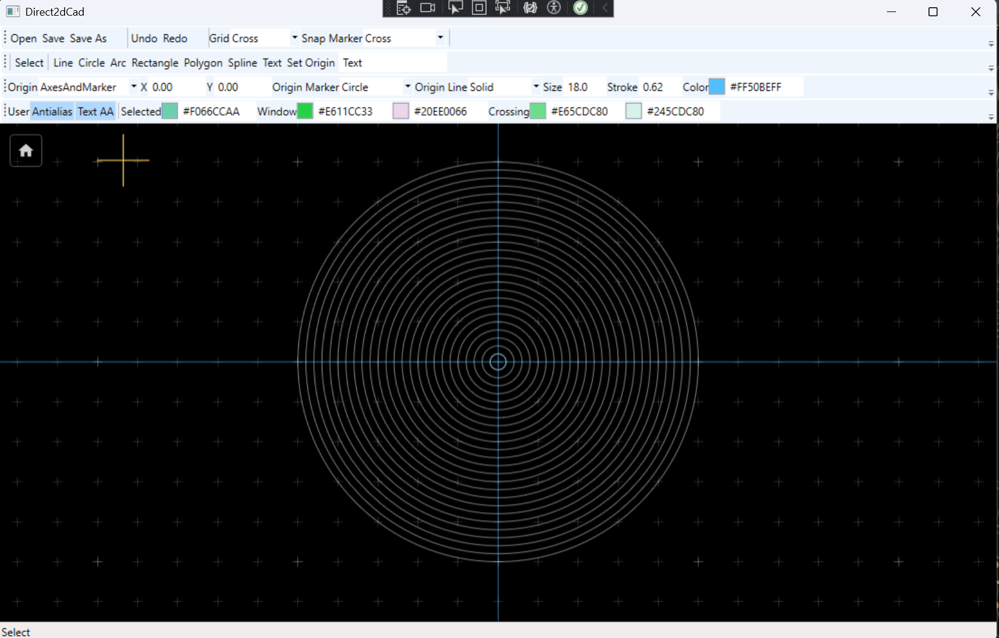
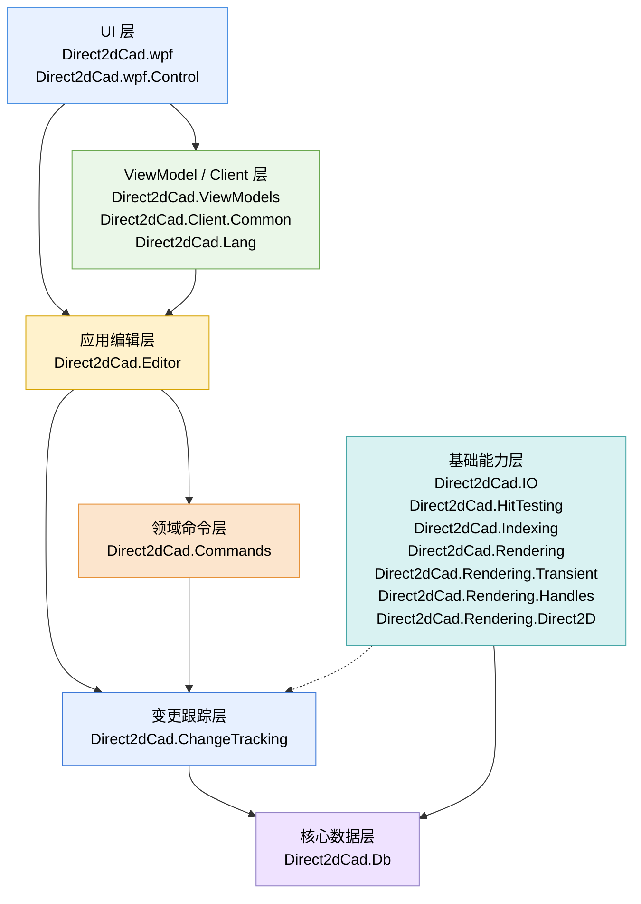
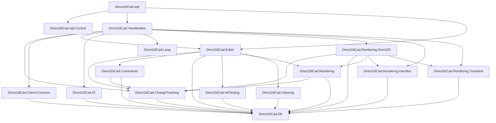

# Direct2dCad

https://www.figma.com/board/wZWqWgQ9dd1p4KQVBakqmS/Direct2dCad?node-id=52-299&t=jXGAkAOnYQmodsTk-4



## 1. 当前项目

当前 `Direct2dCad.slnx` 中保留的项目如下：

```text
Direct2dCad.Db
Direct2dCad.ChangeTracking
Direct2dCad.Commands
Direct2dCad.Editor
Direct2dCad.HitTesting
Direct2dCad.Indexing
Direct2dCad.IO
Direct2dCad.Rendering
Direct2dCad.Rendering.Transient
Direct2dCad.Rendering.Handles
Direct2dCad.Rendering.Direct2D
Direct2dCad.Client.Common
Direct2dCad.Lang
Direct2dCad.ViewModels
Direct2dCad.wpf.Control
Direct2dCad.wpf
```

View / ViewModel 之间的服务接口现在放在 `Direct2dCad.ViewModels\Services`，WPF 实现放在 `Direct2dCad\Services`。

## 2. 架构层级



## 3. 项目依赖图



## 4. 项目说明

### Direct2dCad.Db

核心数据模型层，是 CAD 文档的 source of truth。

项目引用：无。

NuGet：

```text
StronglyTypedId
```

主要职责：

```text
定义 CadDocument、Layer、Block、Entity、Style、FillStyle 等核心模型
定义 Line、Circle、Arc、Ellipse、Rectangle、Polyline、Polygon、Spline、Text、ShapeText 等实体
定义 ViewSettings、GridSettings、OriginSettings、LayerDrawingPriority 等文档级视图设置
定义 CadPointD、CadVectorD、CadRectD、CadMatrixD 等几何类型
定义 EntityId、LayerId、BlockId、StyleId 等强类型 ID
```

### Direct2dCad.ChangeTracking

CAD 文档变更跟踪层。

项目引用：

```text
Direct2dCad.Db
```

主要职责：

```text
定义 CadDocumentChangeSet
定义 CadEntityChange / CadEntityChangeKind
表达实体、文档结构、视图设置的变更范围
为 Commands、Editor、Rendering 之间提供中性的变更通知模型
避免 Rendering / Rendering.Direct2D 直接依赖 Direct2dCad.Commands
```

### Direct2dCad.Commands

CAD 文档命令层。

项目引用：

```text
Direct2dCad.ChangeTracking
Direct2dCad.Db
```

主要职责：

```text
定义 ICadCommand
定义 CadCommandResult
实现可 undo / redo 的文档修改命令
支持单条命令和批量命令
返回 CadDocumentChangeSet 以驱动索引、缓存和渲染资源更新
```

### Direct2dCad.Editor

编辑应用层，协调文档、命令、选择、命中测试、索引和视口。

项目引用：

```text
Direct2dCad.ChangeTracking
Direct2dCad.Commands
Direct2dCad.Db
Direct2dCad.HitTesting
Direct2dCad.Indexing
Direct2dCad.Rendering
```

NuGet：

```text
Microsoft.Extensions.DependencyInjection.Abstractions
```

主要职责：

```text
提供 CadEditor 作为编辑入口
管理文档命令执行、undo、redo
维护选择集
连接命中测试和空间索引
发布 CadDocumentChangeSet
向 ICadGeometryResourceManager 推送几何资源更新
提供视口命令，例如 pan、zoom、fit
```

### Direct2dCad.HitTesting

命中测试层。

项目引用：

```text
Direct2dCad.Db
```

主要职责：

```text
执行 CAD 世界坐标下的点选命中
判断点与实体几何的命中关系
返回命中结果和候选实体
```

### Direct2dCad.Indexing

空间索引层。

项目引用：

```text
Direct2dCad.Db
```

主要职责：

```text
记录实体 Bounds
按区域查询实体
为框选、命中测试、局部刷新提供候选实体集合
```

### Direct2dCad.Rendering

渲染抽象层。

项目引用：

```text
Direct2dCad.ChangeTracking
Direct2dCad.Db
```

主要职责：

```text
定义 ICadRenderer
定义 ICadGeometryResourceManager
定义 CadViewport
定义 CadRenderOptions
定义 CadRenderInvalidation 和多 dirty rect 局部刷新模型
定义 ID3D11ImageSource 桥接接口
```

### Direct2dCad.Rendering.Transient

临时绘制预览场景模型层。

项目引用：

```text
Direct2dCad.Db
```

主要职责：

```text
定义绘制模式中的临时图形
定义选择框预览
定义复制粘贴预览
定义鼠标吸附标记预览
不负责命令执行和实体持久化
```

### Direct2dCad.Rendering.Handles

选中实体可视化句柄场景模型层。

项目引用：

```text
Direct2dCad.Db
```

主要职责：

```text
定义选中实体外框场景
定义 grip / handle 点场景
提供 handle 场景构建和 handle 命中测试
不直接修改 CadDocument
```

### Direct2dCad.Rendering.Direct2D

Direct2D 渲染实现层。

项目引用：

```text
Direct2dCad.ChangeTracking
Direct2dCad.Db
Direct2dCad.Rendering
Direct2dCad.Rendering.Handles
Direct2dCad.Rendering.Transient
```

NuGet：

```text
Vortice.Direct2D1
Vortice.Direct3D11
Vortice.Direct3D9
```

主要职责：

```text
使用 Direct2D 绘制 CadDocument
管理 Direct2D geometry / brush / text 资源
绘制 grid、origin、实体、transient overlay、selection handle overlay
支持多 dirty rect 局部刷新
处理 D3D11 / D3D9 shared surface 与 WPF D3DImage 交互
在 EndDraw 可恢复失败时重建设备资源并触发全量重绘
```

### Direct2dCad.IO

文件读写层。

项目引用：

```text
Direct2dCad.Db
```

NuGet：

```text
MessagePack
Riok.Mapperly
```

主要职责：

```text
保存 CadDocument
读取 CadDocument
定义 .d2cad 文件容器格式
定义文件 section
定义 section 级版本迁移注册
支持读取单独 section，例如 settings
```

### Direct2dCad.Client.Common

客户端通用模型与转换辅助层。

项目引用：

```text
Direct2dCad.Db
```

主要职责：

```text
定义 CadUserSettings
定义用户级渲染和交互设置
提供 LocalizedDescriptionAttribute
提供 EnumDescriptionTypeConverter
区分用户偏好和 CadDocument 文档内容
```

用户设置边界：

```text
CadDocument / CadViewSettings 保存与图纸文件相关的内容：
背景、网格、原点、图层绘制优先级等会随 .d2cad 文件保存。

CadUserSettings 保存与当前用户相关的偏好：
选中颜色、正选 / 反选框颜色、grip 颜色、是否开启抗锯齿等不随图纸文件保存。

服务接口放在 Direct2dCad.ViewModels.Services。
WPF 的本地 JSON 实现放在 Direct2dCad.Services.UserSettingsService。
```

### Direct2dCad.Lang

多语言资源层。

项目引用：无。

NuGet：

```text
Antelcat.I18N.SourceGenerators
```

主要职责：

```text
管理 resx 语言资源
提供 LangKeys
提供 Strings 资源访问类型
支持 WPF 中的 I18N XAML 绑定
```

### Direct2dCad.ViewModels

ViewModel 层。

项目引用：

```text
Direct2dCad.ChangeTracking
Direct2dCad.Client.Common
Direct2dCad.Editor
Direct2dCad.IO
Direct2dCad.Lang
Direct2dCad.Rendering.Direct2D
Direct2dCad.Rendering.Handles
Direct2dCad.Rendering.Transient
```

NuGet：

```text
CommunityToolkit.Mvvm
Dirkster.AvalonDock.Core
Dirkster.AvalonDock.Mvvm
Dirkster.AvalonDock.Mvvm.CommunityToolkit
Microsoft.Extensions.DependencyInjection.Abstractions
```

主要职责：

```text
定义 MainViewModel、EditorTabViewModel、CadDocumentViewModel
管理绘制模式、选择、拖拽、复制粘贴、原点设置、用户设置同步
维护 transient scene 和 handle scene
调用 Direct2DImageRenderHost 渲染
定义 IFileDialogService、IMessageBoxService、IUserSettingsService、ICultureSettingService、IThemeSettingService
定义 ThemeChangedEvent
```

### Direct2dCad.wpf.Control

WPF 控件库项目，当前文件夹为 `Direct2dCad.Control`。

项目引用：无。

项目配置：

```text
net10.0-windows
UseWPF=true
```

### Direct2dCad.wpf

WPF 应用层。

项目引用：

```text
Direct2dCad.wpf.Control
Direct2dCad.Editor
Direct2dCad.ViewModels
```

NuGet：

```text
Antelcat.I18N.WPF
CommunityToolkit.Mvvm
Dirkster.AvalonDock
Dirkster.AvalonDock.DependencyInjection
Dirkster.AvalonDock.Themes.Arc
MahApps.Metro
MaterialDesignThemes.MahApps
MessagePipe
Microsoft.Extensions.DependencyInjection
```

主要职责：

```text
提供 WPF 启动入口
提供 MainWindow 和 CadCanvas
实现文件对话框、消息框、主题、文化切换、用户设置读写服务
承载 D3D11ImageSource / D3DImage
通过依赖注入装配 ViewModel 和 WPF 服务
```

## 5. 实际项目引用表

| 项目 | 当前项目引用 |
|---|---|
| `Direct2dCad.Db` | 无 |
| `Direct2dCad.ChangeTracking` | `Direct2dCad.Db` |
| `Direct2dCad.Commands` | `Direct2dCad.ChangeTracking`, `Direct2dCad.Db` |
| `Direct2dCad.Editor` | `Direct2dCad.ChangeTracking`, `Direct2dCad.Commands`, `Direct2dCad.Db`, `Direct2dCad.HitTesting`, `Direct2dCad.Indexing`, `Direct2dCad.Rendering` |
| `Direct2dCad.HitTesting` | `Direct2dCad.Db` |
| `Direct2dCad.Indexing` | `Direct2dCad.Db` |
| `Direct2dCad.IO` | `Direct2dCad.Db` |
| `Direct2dCad.Rendering` | `Direct2dCad.ChangeTracking`, `Direct2dCad.Db` |
| `Direct2dCad.Rendering.Transient` | `Direct2dCad.Db` |
| `Direct2dCad.Rendering.Handles` | `Direct2dCad.Db` |
| `Direct2dCad.Rendering.Direct2D` | `Direct2dCad.ChangeTracking`, `Direct2dCad.Db`, `Direct2dCad.Rendering`, `Direct2dCad.Rendering.Handles`, `Direct2dCad.Rendering.Transient` |
| `Direct2dCad.Client.Common` | `Direct2dCad.Db` |
| `Direct2dCad.Lang` | 无 |
| `Direct2dCad.ViewModels` | `Direct2dCad.ChangeTracking`, `Direct2dCad.Client.Common`, `Direct2dCad.Editor`, `Direct2dCad.IO`, `Direct2dCad.Lang`, `Direct2dCad.Rendering.Direct2D`, `Direct2dCad.Rendering.Handles`, `Direct2dCad.Rendering.Transient` |
| `Direct2dCad.wpf.Control` | 无 |
| `Direct2dCad.wpf` | `Direct2dCad.wpf.Control`, `Direct2dCad.Editor`, `Direct2dCad.ViewModels` |

## 6. 主要依赖链路

### 主程序链路

```text
Direct2dCad.wpf
  ├─ Direct2dCad.wpf.Control
  ├─ Direct2dCad.Editor
  │   ├─ Direct2dCad.ChangeTracking
  │   │   └─ Direct2dCad.Db
  │   ├─ Direct2dCad.Commands
  │   │   ├─ Direct2dCad.ChangeTracking
  │   │   └─ Direct2dCad.Db
  │   ├─ Direct2dCad.HitTesting
  │   │   └─ Direct2dCad.Db
  │   ├─ Direct2dCad.Indexing
  │   │   └─ Direct2dCad.Db
  │   └─ Direct2dCad.Rendering
  │       ├─ Direct2dCad.ChangeTracking
  │       └─ Direct2dCad.Db
  └─ Direct2dCad.ViewModels
      ├─ Direct2dCad.Client.Common
      │   └─ Direct2dCad.Db
      ├─ Direct2dCad.Editor
      ├─ Direct2dCad.IO
      │   └─ Direct2dCad.Db
      ├─ Direct2dCad.Lang
      ├─ Direct2dCad.Rendering.Direct2D
      │   ├─ Direct2dCad.ChangeTracking
      │   ├─ Direct2dCad.Db
      │   ├─ Direct2dCad.Rendering
      │   ├─ Direct2dCad.Rendering.Handles
      │   └─ Direct2dCad.Rendering.Transient
      ├─ Direct2dCad.Rendering.Handles
      │   └─ Direct2dCad.Db
      └─ Direct2dCad.Rendering.Transient
          └─ Direct2dCad.Db
```

### 服务链路

```text
Direct2dCad.ViewModels.Services
  ├─ ICultureSettingService
  ├─ IFileDialogService
  ├─ IMessageBoxService
  ├─ IThemeSettingService
  └─ IUserSettingsService

Direct2dCad.Services
  ├─ CultureSettingService
  ├─ FileDialogService
  ├─ MessageBoxService
  ├─ ThemeSettingService
  └─ UserSettingsService
```

### 渲染链路

```text
CadDocumentViewModel
  └─ Direct2DImageRenderHost
      ├─ Direct2DSceneRender
      ├─ Direct2DResourceCache
      ├─ ImageSourceDirect2DResource
      ├─ CadTransientScene
      └─ CadHandleScene

Direct2dCad.Rendering
  ├─ CadViewport
  ├─ CadRenderOptions
  ├─ CadRenderInvalidation
  ├─ ICadRenderer
  └─ ICadGeometryResourceManager
```

## 7. NuGet 依赖汇总

| 项目 | NuGet 依赖 |
|---|---|
| `Direct2dCad.Db` | `StronglyTypedId` |
| `Direct2dCad.Editor` | `Microsoft.Extensions.DependencyInjection.Abstractions` |
| `Direct2dCad.IO` | `MessagePack`, `Riok.Mapperly` |
| `Direct2dCad.Rendering.Direct2D` | `Vortice.Direct2D1`, `Vortice.Direct3D11`, `Vortice.Direct3D9` |
| `Direct2dCad.ViewModels` | `CommunityToolkit.Mvvm`, `Dirkster.AvalonDock.Core`, `Dirkster.AvalonDock.Mvvm`, `Dirkster.AvalonDock.Mvvm.CommunityToolkit`, `Microsoft.Extensions.DependencyInjection.Abstractions` |
| `Direct2dCad.wpf` | `Antelcat.I18N.WPF`, `CommunityToolkit.Mvvm`, `Dirkster.AvalonDock`, `Dirkster.AvalonDock.DependencyInjection`, `Dirkster.AvalonDock.Themes.Arc`, `MahApps.Metro`, `MaterialDesignThemes.MahApps`, `MessagePipe`, `Microsoft.Extensions.DependencyInjection` |
| `Direct2dCad.Lang` | `Antelcat.I18N.SourceGenerators` |

## 8. 构建

```powershell
dotnet build .\Direct2dCad.slnx
```
