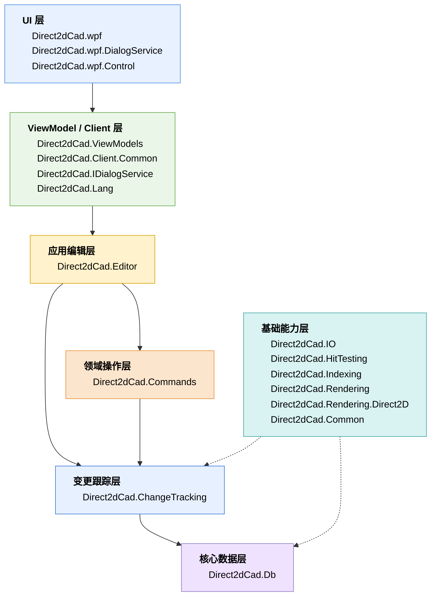
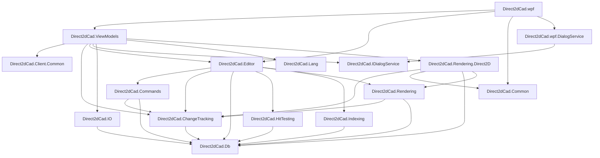

# Direct2dCad
https://www.figma.com/board/wZWqWgQ9dd1p4KQVBakqmS/Direct2dCad?node-id=52-299&t=jXGAkAOnYQmodsTk-4

## 1. 架构层级




## 2. 项目依赖关系



## 3. 项目说明

### Direct2dCad.Db

核心数据模型层。

#### 项目引用

无项目引用。

#### NuGet 依赖

```text
StronglyTypedId
```

#### 主要职责

```text
定义 CAD 文档模型
定义 CAD 图层模型
定义 CAD 块定义模型
定义 CAD 实体模型
定义 CAD 样式模型
定义几何基础类型
定义强类型 ID
```

#### 主要类型

```text
CadDocument
CadLayer
CadBlockDefinition
CadEntity
CadLine
CadCircle
CadArc
CadPolyline
CadText
CadBlockReference
CadGraphicStyle
CadTextStyle
CadFillStyle
CadPointD
CadVectorD
CadRectD
CadMatrixD
EntityId
LayerId
BlockId
StyleId
```

---

### Direct2dCad.ChangeTracking

CAD 文档变更跟踪层。

#### 项目引用

```text
Direct2dCad.Db
```

#### 主要职责

```text
定义 CadDocument 修改后的变更结果
定义实体级变更类型
定义文档结构变更标记
定义视图设置变更标记
为 Commands / Editor / Rendering 提供中性的变更通知模型
避免 Rendering / Rendering.Direct2D 直接依赖 Direct2dCad.Commands
```

#### 主要类型

```text
CadDocumentChangeSet
CadEntityChange
CadEntityChangeKind
```

---

### Direct2dCad.Commands

CAD 文档命令层。

#### 项目引用

```text
Direct2dCad.ChangeTracking
Direct2dCad.Db
```

#### 主要职责

```text
执行 CadDocument 修改操作
提供 Undo / Redo 所需的命令对象
返回文档变化结果
```

#### 主要类型

```text
AddLineCommand
AddCircleCommand
AddTextCommand
MoveEntitiesCommand
DeleteEntitiesCommand
DuplicateEntitiesCommand
ChangeLayerCommand
SetEntityColorCommand
SetLineGeometryCommand
SetCircleGeometryCommand
SetTextContentCommand
SetOriginSettingsCommand
SetOriginPositionCommand
```

---

### Direct2dCad.Editor

编辑器核心协调层。

#### 项目引用

```text
Direct2dCad.ChangeTracking
Direct2dCad.Commands
Direct2dCad.Db
Direct2dCad.HitTesting
Direct2dCad.Indexing
Direct2dCad.Rendering
```

#### 主要职责

```text
管理 CadDocument
管理 CadViewport
管理选择集
执行文档命令
执行编辑器命令
管理 Undo / Redo 历史
发布文档变化
更新 DirtySet
调用空间索引
调用渲染资源管理器
```

#### 主要类型

```text
CadEditor
CadSession
CadSelectionSet
DirtySet
CadDocumentCommandManager
CadEditorCommandManager
CadDocumentChangeDispatcher
CommandHistory
ClickSelectCommand
BoxSelectCommand
PanViewportCommand
ZoomViewportCommand
```

---

### Direct2dCad.HitTesting

命中测试层。

#### 项目引用

```text
Direct2dCad.Db
```

#### 主要职责

```text
执行 CAD 坐标下的点选测试
判断点与实体的命中关系
返回命中结果
```

#### 主要类型

```text
CadEntityHitTester
CadHitTestService
CadHitTestResult
```

---

### Direct2dCad.Indexing

空间索引层。

#### 项目引用

```text
Direct2dCad.Db
```

#### 主要职责

```text
记录实体 Bounds
按区域查询实体
为框选提供候选实体集合
为局部刷新提供候选实体集合
为命中测试提供候选实体集合
```

#### 主要类型

```text
ICadSpatialIndex
CadSpatialIndex
CadSpatialIndexEntry
CadSpatialQuery
CadSpatialQueryResult
```

---

### Direct2dCad.Rendering

渲染抽象层。

#### 项目引用

```text
Direct2dCad.ChangeTracking
Direct2dCad.Db
```

#### 主要职责

```text
定义渲染器接口
定义视口模型
定义渲染选项
定义临时预览场景
定义几何资源管理接口
```

#### 主要类型

```text
ICadRenderer
ICadGeometryResourceManager
CadViewport
CadRenderOptions
CadRender
CadTransientScene
CadTransientItem
CadTransientStyle
```

---

### Direct2dCad.Rendering.Direct2D

Direct2D 渲染实现层。

#### 项目引用

```text
Direct2dCad.ChangeTracking
Direct2dCad.Common
Direct2dCad.Db
Direct2dCad.Rendering
```

#### NuGet 依赖

```text
Vortice.Direct2D1
Vortice.Direct3D11
Vortice.Direct3D9
```

#### 主要职责

```text
使用 Direct2D 绘制 CadDocument
管理 Direct2D 几何资源
管理 Direct2D 画刷资源
管理 D3D11 / D3D9 shared surface
向 WPF D3DImage 提供渲染结果
```

#### 主要类型

```text
Direct2DImageRenderHost
Direct2DSceneRender
Direct2DResourceCache
ImageSourceDirect2DResource
```

---

### Direct2dCad.IO

文件读写层。

#### 项目引用

```text
Direct2dCad.Db
```

#### NuGet 依赖

```text
MessagePack
Riok.Mapperly
```

#### 主要职责

```text
保存 CadDocument
读取 CadDocument
定义 .d2cad 文件容器格式
定义文件 Section
定义文件版本迁移注册
```

#### 主要类型

```text
CadDocumentStorage
CadContainerFormat
CadFileModels
CadSectionKind
CadSectionMigrationRegistry
```

---

### Direct2dCad.ViewModels

ViewModel 层。

#### 项目引用

```text
Direct2dCad.ChangeTracking
Direct2dCad.Client.Common
Direct2dCad.Editor
Direct2dCad.IDialogService
Direct2dCad.IO
Direct2dCad.Lang
Direct2dCad.Rendering.Direct2D
```

#### NuGet 依赖

```text
CommunityToolkit.Mvvm
Microsoft.Extensions.DependencyInjection.Abstractions
```

#### 主要职责

```text
管理主窗口状态
管理 CAD 文档视图状态
处理画布输入数据
处理工具模式
调用 CadEditor 执行编辑操作
调用 IO 服务执行打开 / 保存
调用对话框抽象服务
维护渲染宿主对象
```

#### 主要类型

```text
MainViewModel
CadDocumentViewModel
CadCanvasInput
Enums
ServiceCollectionExtension
```

---

### Direct2dCad.IDialogService

UI 对话框抽象层。

#### 项目引用

无项目引用。

#### 主要职责

```text
定义打开文件接口
定义保存文件接口
定义消息框接口
```

#### 主要类型

```text
IFileDialogService
IMessageBoxService
```

---

### Direct2dCad.wpf.DialogService

WPF 对话框实现层。

#### 项目引用

```text
Direct2dCad.IDialogService
```

#### 主要职责

```text
实现 IFileDialogService
实现 IMessageBoxService
提供 DI 注册扩展
```

#### 主要类型

```text
FileDialogService
MessageBoxService
ServiceCollectionExtension
```

---

### Direct2dCad.wpf

WPF 主程序。

#### 项目引用

```text
Direct2dCad.Common
Direct2dCad.Editor
Direct2dCad.ViewModels
Direct2dCad.wpf.DialogService
```

#### NuGet 依赖

```text
CommunityToolkit.Mvvm
MessagePipe
Microsoft.Extensions.DependencyInjection
```

#### 主要职责

```text
程序启动
配置依赖注入容器
创建主窗口
承载 CAD 画布控件
承载 D3D11ImageSource
绑定 ViewModel
将 WPF 鼠标输入转换为画布输入数据
将 WPF 键盘输入转换为画布输入数据
```

#### 主要文件

```text
App.xaml.cs
MainWindow.xaml.cs
Controls/CadCanvas.xaml.cs
Controls/D3D11ImageSource.cs
Views/CadDocumentView.xaml.cs
```

---

### Direct2dCad.Common

通用桥接接口层。

#### 项目引用

无项目引用。

#### 主要职责

```text
定义 D3D11 图像源接口
定义通用矩形结构
为 Direct2D 渲染层和 WPF 图像源提供桥接类型
```

#### 主要类型

```text
ID3D11ImageSource
Int32Rect
```

---

### Direct2dCad.Client.Common

客户端通用工具层。

#### 项目引用

无项目引用。

#### 主要职责

```text
提供客户端通用特性
提供枚举描述转换
提供本地化描述读取能力
```

#### 主要类型

```text
LocalizedDescriptionAttribute
EnumDescriptionTypeConverter
```

---

### Direct2dCad.Lang

多语言资源层。

#### 项目引用

无项目引用。

#### NuGet 依赖

```text
Antelcat.I18N.SourceGenerators
```

#### 主要职责

```text
管理语言资源
提供资源 Key
提供 resx 资源访问类型
```

#### 主要类型

```text
LangKeys
Strings
Strings.Designer.cs
.resx
```

---

### Direct2dCad.wpf.Control

WPF 控件库。

#### 项目引用

无项目引用。

#### 项目配置

```text
net10.0-windows
UseWPF=true
```

#### 当前内容

```text
AssemblyInfo.cs
```

---

### Direct2dCad.winui

WinUI 客户端项目。

#### 项目引用

无项目引用。

#### NuGet 依赖

```text
Microsoft.WindowsAppSDK
Microsoft.Windows.SDK.BuildTools
```

#### 主要内容

```text
App.xaml.cs
MainWindow.xaml.cs
```

## 4. 实际项目引用表

| 项目 | 当前引用 |
|---|---|
| `Direct2dCad.Db` | 无项目引用 |
| `Direct2dCad.ChangeTracking` | `Direct2dCad.Db` |
| `Direct2dCad.Commands` | `Direct2dCad.ChangeTracking`, `Direct2dCad.Db` |
| `Direct2dCad.HitTesting` | `Direct2dCad.Db` |
| `Direct2dCad.Indexing` | `Direct2dCad.Db` |
| `Direct2dCad.IO` | `Direct2dCad.Db` |
| `Direct2dCad.Rendering` | `Direct2dCad.ChangeTracking`, `Direct2dCad.Db` |
| `Direct2dCad.Rendering.Direct2D` | `Direct2dCad.ChangeTracking`, `Direct2dCad.Common`, `Direct2dCad.Db`, `Direct2dCad.Rendering` |
| `Direct2dCad.Editor` | `Direct2dCad.ChangeTracking`, `Direct2dCad.Commands`, `Direct2dCad.Db`, `Direct2dCad.HitTesting`, `Direct2dCad.Indexing`, `Direct2dCad.Rendering` |
| `Direct2dCad.ViewModels` | `Direct2dCad.ChangeTracking`, `Direct2dCad.Client.Common`, `Direct2dCad.Editor`, `Direct2dCad.IDialogService`, `Direct2dCad.IO`, `Direct2dCad.Lang`, `Direct2dCad.Rendering.Direct2D` |
| `Direct2dCad.wpf.DialogService` | `Direct2dCad.IDialogService` |
| `Direct2dCad.wpf` | `Direct2dCad.Common`, `Direct2dCad.Editor`, `Direct2dCad.ViewModels`, `Direct2dCad.wpf.DialogService` |
| `Direct2dCad.Common` | 无项目引用 |
| `Direct2dCad.Client.Common` | 无项目引用 |
| `Direct2dCad.IDialogService` | 无项目引用 |
| `Direct2dCad.Lang` | 无项目引用 |
| `Direct2dCad.wpf.Control` | 无项目引用 |
| `Direct2dCad.winui` | 无项目引用 |

## 5. 依赖链路

### 主程序链路

```text
Direct2dCad.wpf
  ├─ Direct2dCad.ViewModels
  │   ├─ Direct2dCad.ChangeTracking
  │   │   └─ Direct2dCad.Db
  │   ├─ Direct2dCad.Editor
  │   │   ├─ Direct2dCad.ChangeTracking
  │   │   │   └─ Direct2dCad.Db
  │   │   ├─ Direct2dCad.Commands
  │   │   │   ├─ Direct2dCad.ChangeTracking
  │   │   │   └─ Direct2dCad.Db
  │   │   ├─ Direct2dCad.HitTesting
  │   │   │   └─ Direct2dCad.Db
  │   │   ├─ Direct2dCad.Indexing
  │   │   │   └─ Direct2dCad.Db
  │   │   └─ Direct2dCad.Rendering
  │   │       ├─ Direct2dCad.ChangeTracking
  │   │       └─ Direct2dCad.Db
  │   ├─ Direct2dCad.IO
  │   │   └─ Direct2dCad.Db
  │   ├─ Direct2dCad.IDialogService
  │   ├─ Direct2dCad.Lang
  │   ├─ Direct2dCad.Client.Common
  │   └─ Direct2dCad.Rendering.Direct2D
  │       ├─ Direct2dCad.ChangeTracking
  │       ├─ Direct2dCad.Common
  │       ├─ Direct2dCad.Db
  │       └─ Direct2dCad.Rendering
  ├─ Direct2dCad.Editor
  ├─ Direct2dCad.Common
  └─ Direct2dCad.wpf.DialogService
      └─ Direct2dCad.IDialogService
```

### 数据模型相关链路

```text
Direct2dCad.Db
  ├─ 被 Direct2dCad.ChangeTracking 引用
  ├─ 被 Direct2dCad.Commands 引用
  ├─ 被 Direct2dCad.Editor 引用
  ├─ 被 Direct2dCad.HitTesting 引用
  ├─ 被 Direct2dCad.Indexing 引用
  ├─ 被 Direct2dCad.IO 引用
  ├─ 被 Direct2dCad.Rendering 引用
  └─ 被 Direct2dCad.Rendering.Direct2D 引用
```

### UI 对话框链路

```text
Direct2dCad.ViewModels
  └─ Direct2dCad.IDialogService

Direct2dCad.wpf.DialogService
  └─ Direct2dCad.IDialogService

Direct2dCad.wpf
  └─ Direct2dCad.wpf.DialogService
```

### 渲染链路

```text
Direct2dCad.ViewModels
  └─ Direct2dCad.Rendering.Direct2D
      ├─ Direct2dCad.ChangeTracking
      ├─ Direct2dCad.Rendering
      ├─ Direct2dCad.Db
      └─ Direct2dCad.Common

Direct2dCad.Rendering
  ├─ Direct2dCad.ChangeTracking
  └─ Direct2dCad.Db
```

## 6. NuGet 依赖汇总

| 项目 | NuGet 依赖 |
|---|---|
| `Direct2dCad.Db` | `StronglyTypedId` |
| `Direct2dCad.IO` | `MessagePack`, `Riok.Mapperly` |
| `Direct2dCad.Rendering.Direct2D` | `Vortice.Direct2D1`, `Vortice.Direct3D11`, `Vortice.Direct3D9` |
| `Direct2dCad.ViewModels` | `CommunityToolkit.Mvvm`, `Microsoft.Extensions.DependencyInjection.Abstractions` |
| `Direct2dCad.wpf` | `CommunityToolkit.Mvvm`, `MessagePipe`, `Microsoft.Extensions.DependencyInjection` |
| `Direct2dCad.Lang` | `Antelcat.I18N.SourceGenerators` |
| `Direct2dCad.winui` | `Microsoft.WindowsAppSDK`, `Microsoft.Windows.SDK.BuildTools` |
