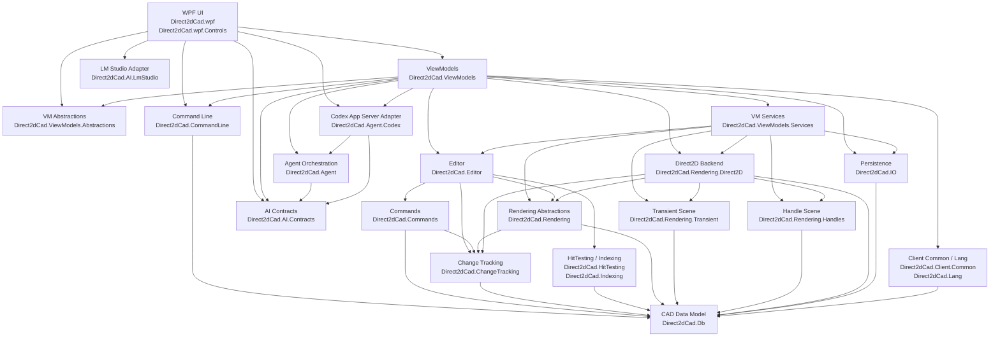

# 架构与项目职责

[返回首页](../README.md) · [CAD 能力与不足](CAD-READINESS.md) · [性能与渲染](PERFORMANCE.md)

当前实现以 `CadDocument` 为图纸数据源，以文档命令管理修改和历史，由 Editor 分发变更，再更新空间查询与 Direct2D 资源。下面先列分层和职责，再列实际项目依赖。

模型、命令、文件格式、命令行协议有独立边界；当前 ViewModel 和业务服务仍直接使用 Direct2D 宿主、文本测量等能力。迁移到其他 UI 或渲染后端需要继续抽取这些接口，不能仅替换窗口。

2026-10-03 的 M1–M3 增加了以下协作路径，完整范围见[实施状态](M1-M3-STATUS.md)：

- Db 提供毫米公差、参数曲线、解析求交和自适应测量；Commands 构造不可变编辑计划，UI 与工具共用计划后以文档命令提交。预览读取计划，不创建实体；拆分/合并返回新 ID。
- 绘图默认值、显式输入、鼠标捕捉与编辑对象 picking 分开。显式坐标保持原值，对象捕捉查询活动空间索引；原始指针用于选对象和同源预览。
- 精确数字输入和候选切换位于画布，动态输入共用当前文档的工具状态；AvalonDock 的“图纸恢复”直接展示恢复稿列表。简短状态、单位、网格间距和捕捉/约束图标放状态栏。旧布局恢复只补新增面板，保留原面板位置与尺寸。
- Terminal 基础命令保持独立模块，常用变换/布尔简写经 ViewModels 路由到与 AI 相同的 workspace 执行器。文档命令和编辑器历史保持分离；AI 工具在公共执行器发布开始、完成、失败和取消消息，Terminal 有界分批显示。接口和记录边界见[命令行与 AI](COMMANDS-AND-AI.md)。
- IO 统一预算、版本、已识别引用和只读兼容策略；保存会话绑定目标文件版本，恢复使用独立快照目录。未知 section 不能证明引用可安全编辑，默认只读展示。
- 查询先在文档所属线程协作采集独立快照，再后台遍历；采集后和返回前校验文档版本、选择、owner、存活状态，丢弃晚到结果。
- 本地化强类型资源在 MSBuild 中由 `.resx` 自动生成，再由 `ResourceKeysOf` 生成键及翻译映射；新增标签不再依赖 IDE 手动刷新 Designer，避免界面显示资源键。

## 项目组成

| 分层 | 项目 |
|---|---|
| 核心编辑 | `Direct2dCad.Db`, `Direct2dCad.ChangeTracking`, `Direct2dCad.Commands`, `Direct2dCad.CommandLine`, `Direct2dCad.Editor` |
| AI 与 Agent | `Direct2dCad.AI.Contracts`, `Direct2dCad.AI.LmStudio`, `Direct2dCad.Agent`, `Direct2dCad.Agent.Codex` |
| 查询与存储 | `Direct2dCad.HitTesting`, `Direct2dCad.Indexing`, `Direct2dCad.IO` |
| 渲染 | `Direct2dCad.Rendering`, `Direct2dCad.Rendering.Transient`, `Direct2dCad.Rendering.Handles`, `Direct2dCad.Rendering.Direct2D` |
| 客户端公共能力 | `Direct2dCad.Client.Common`, `Direct2dCad.Lang` |
| ViewModel | `Direct2dCad.ViewModels.Abstractions`, `Direct2dCad.ViewModels.Services`, `Direct2dCad.ViewModels` |
| WPF | `Direct2dCad.wpf.Controls`, `Direct2dCad.wpf` |

`Direct2dCad.ViewModels.Services` 保存平台接口和 UI 无关的交互协作者；WPF 实现位于 `Direct2dCad.wpf/Services`，跨 ViewModel 通信使用 MessagePipe。

## 架构分层

下图表示主要协作链路；完整项目引用以文末从 `.csproj` 核对的表为准。

## 项目职责

### Direct2dCad.AI.Contracts

AI 对话、工具和设置的共享契约，不引用 WPF、具体模型服务和 CAD 数据模型。

- 定义 assistant、tool call 和 tool result 消息协议。
- 定义 AI 客户端、设置和设置存储接口，供 Agent 与各模型适配器复用。

### Direct2dCad.AI.LmStudio

LM Studio/OpenAI-compatible 协议实现，只依赖 `Direct2dCad.AI.Contracts`。

- 获取 LM Studio 已加载的模型，并调用 `/v1/chat/completions`。
- 保存连接地址、模型、temperature 和 CAD 工具开关等用户级设置。

### Direct2dCad.Agent

与 UI、WPF 和 CAD 数据模型无关的 Agent 编排层。

- 管理对话历史、上下文窗口预算和超限重试。
- 执行模型、工具结果、再次调用模型的多轮循环。
- 通过 `IAgentToolset` 使用宿主提供的工具，不直接依赖具体 CAD 命令。
- 通过事件报告 assistant 消息、工具结果和上下文压缩状态。

### Direct2dCad.Agent.Codex

Codex app-server 适配层，复用 Codex CLI 的本机认证和模型配置。

- 通过持久化 stdio JSON-RPC 连接获取模型、管理对话线程并执行 turn。
- 将 `IAgentToolset` 注册为 Codex dynamic tools，与 LM Studio 和 Terminal 共用同一套 CAD 查询及编辑命令。
- 将 CAD 工具执行切回 UI 同步上下文，编辑结果继续进入 `ICadCommand`、undo / redo 和渲染更新链路。
- 支持取消当前 turn；切换提供商、模型或工具配置后会重建 Codex 会话。

CAD 工具目录、查询及执行器位于 `Direct2dCad.ViewModels.Tools` 适配层，并由 AI Agent 和终端共同使用；实体编辑仍通过 `ICadCommand` 进入 undo / redo 和渲染更新链路。

AI Toolbox 的连接配置位于齿轮按钮打开的 MaterialDesign 对话框中。LM Studio 默认连接 `http://localhost:1234/v1`，需先启动 Local Server 并加载支持 tool calling 的模型；Codex 通过本机 `codex app-server` 工作，沿用 Codex CLI 的登录状态，可使用配置默认模型或在对话框中选择模型。AI 可通过稳定的 `document_id` 查询、创建、打开、激活、重命名、保存和关闭工作区图纸，也可在创建实体时设置颜色、线宽、填充与描边样式；同一次用户请求中，每个目标文档分别使用独立的 undo / redo batch。

### Direct2dCad.Db

核心 CAD 数据模型层，是图纸内容的 source of truth。

主要职责：

- 定义 `CadDocument`、Layer、Block、Entity、Style、FillStyle、HatchPattern 等核心模型。
- 定义 line、circle、arc、ellipse、ellipse arc、rectangle、polyline、spline、text、shape text、block reference 等实体。
- 定义文档级 `CadViewSettings`、grid、origin、layer drawing priority 等设置。
- 定义 `CadPointD`、`CadVectorD`、`CadRectD`、`CadMatrixD` 等几何类型。
- 定义 `EntityId`、`LayerId`、`BlockId`、`StyleId` 等强类型 ID。

原则：这里不依赖 editor、rendering、WPF，也不直接关心 Direct2D 资源。

### Direct2dCad.ChangeTracking

CAD 文档变更描述层。

主要职责：

- 定义 `CadDocumentChangeSet`。
- 定义实体、文档结构、视图设置等变更范围。
- 区分 geometry、appearance、fill、visibility、layer、draw order 等变更类型。
- 作为 Commands、Editor、Indexing、Rendering 之间的中性通知模型。
- 避免 `Direct2dCad.Rendering` / `Direct2dCad.Rendering.Direct2D` 直接依赖 `Direct2dCad.Commands`。

### Direct2dCad.Commands

CAD 文档命令层。

主要职责：

- 定义 `ICadCommand` 和命令执行结果。
- 实现实体 CRUD、属性修改、图层修改、原点设置等可 undo / redo 的文档命令。
- 使用统一的剪贴板快照实现复制、粘贴和重复实体，支持嵌套 Block Reference 及其依赖资源。
- 支持单条命令和批量命令。
- 批量命令是否按组 undo / redo，应该由命令管理设置决定，而不是由渲染层决定。
- 命令执行后返回 `CadDocumentChangeSet`，用于索引、缓存和 Direct2D 资源更新。

### Direct2dCad.CommandLine

与 UI 无关的 CAD 命令行协议与解析层。

主要职责：

- 定义命令目录、语法、别名、执行上下文和执行结果。
- 通过 `ICadCommandLineHandler` 和 `CadCommandLineRegistry` 注册内置、插件或 AI 命令，无需修改中心 switch。
- 支持 `HELP`、undo / redo、fit、选择、删除、复制粘贴以及实体绘制模式命令；复制粘贴结果会报告实体、块引用和依赖块定义数量。
- 支持 Tab 补全、命令历史、空 Enter 重复命令，以及 `X,Y`、`@dX,dY`、`@距离<角度` 坐标输入。
- 将圆、圆弧、椭圆等命令的子模式转换为稳定的语义枚举。
- 不依赖 WPF、ViewModels 或 Editor；当前为复用文档单位枚举与换算而引用 Db，可供桌面 UI、脚本和插件复用。

WPF Terminal 的日志、输入历史和当前文档适配仍由 ViewModel 层负责；真实的文档和视口操作继续进入 Editor 命令系统。

### Direct2dCad.Editor

编辑应用层，协调文档、命令、选择、命中测试、索引、视口和渲染资源更新。

主要职责：

- 提供 `CadEditor` 作为编辑入口。
- 管理文档命令执行、undo、redo。
- 维护选择集。
- 连接 hit testing 和 spatial index。
- 发布 `CadDocumentChangeSet`。
- 根据实体变更通知 `ICadGeometryResourceManager` 更新或释放 geometry / brush / text 等资源。
- 提供 pan、zoom、fit 等视口命令。

### Direct2dCad.HitTesting

命中测试层。

主要职责：

- 在 CAD 世界坐标下执行点选、框选、反选候选判断。
- 命中测试需要考虑实体几何、line weight、文本外框或填充规则、block reference 变换等。
- 返回候选实体和命中信息，供 Editor / ViewModels 决定选择行为。

### Direct2dCad.Indexing

空间索引层。

主要职责：

- 记录实体 bounds。
- 按区域查询候选实体。
- 为框选、命中测试、局部刷新提供候选集合。
- 范围计数复用 BVH 节点计数，并用修改前后的 bounds 修正增量；大索引的后续重建基于值快照在后台执行，期间查询合并最新修改。首次构建和快照采集仍在调用线程完成，索引本身不是并发读写容器。
- 当实体 geometry / line weight / fill / visibility / layer 等影响 bounds 或可见性的属性改变时，需要通过变更通知更新索引。

### Direct2dCad.Rendering

渲染抽象层，不绑定具体 Direct2D 后端。

主要职责：

- 定义 `ICadRenderer`。
- 定义 `ICadGeometryResourceManager`。
- 定义 `CadViewport`、`CadRenderOptions`。
- 定义 `CadRenderInvalidation`、`CadScreenRect` 和多 dirty rect 局部刷新模型。
- 定义 `ID3D11ImageSource` 桥接接口，支持 WPF 图像源按 dirty rect 刷新。

### Direct2dCad.Rendering.Transient

临时绘制预览场景模型层。

主要职责：

- 定义绘制模式中的临时图形，例如 circle / arc / ellipse / line / polyline / spline / polygon / rectangle / text 预览。
- 定义选择框、复制粘贴预览、snap marker、绘制辅助线和测量文字。
- 使用可递归变换的 transient group 表示跨文档 Block 粘贴预览，并纳入局部刷新、图像和 OLE 缓存管理。
- Transient 图形的 stroke、fill、hatch、line weight 应尽量与最终实体绘制一致。
- 不负责命令执行，也不把临时图形持久化到 `CadDocument`。

### Direct2dCad.Rendering.Handles

选中实体可视化 handle / grip 场景模型层。

主要职责：

- 定义选中外框、grip / handle 点、handle 场景。
- 提供 handle 场景构建和 handle 命中测试所需的数据模型。
- 描述 handle 的位置、类型、尺寸和显示方式。
- 不直接修改 `CadDocument`，实际移动或缩放由 Editor / Commands 完成。

### Direct2dCad.Rendering.Direct2D

Direct2D 渲染实现层，应该保留为独立项目。`Direct2dCad.Rendering` 是抽象；`Direct2dCad.Rendering.Direct2D` 是当前后端实现。

主要职责：

- 使用 Direct2D 绘制 `CadDocument`。
- 使用 DirectWrite 测量和绘制 TrueType 文本。
- 管理 Direct2D geometry / brush / text layout / hatch brush 等资源缓存。
- 绘制 background、grid、origin、实体、transient overlay、selection handle overlay。
- 支持 full render 和多 dirty rect 局部刷新。
- 处理 D3D11 / D3D9 shared surface 与 WPF `D3DImage` 交互。
- 在 `EndDraw` 出现可恢复设备失败时重建设备资源并触发全量重绘。

原则：绘制时不应该临时创建所有实体资源；实体创建、修改、删除时应通过 change tracking 驱动资源创建、更新和释放。特殊情况下可以延迟创建，但不能让正常绘制路径变成主要资源构造路径。

### Direct2dCad.IO

文件读写层。

主要职责：

- 保存和读取 `CadDocument`。
- 定义 `.d2cad` 文件容器和 section。
- 支持 section 级版本迁移。
- 支持读取单独 section，例如只读取 settings。
- 序列化文档级 view settings、layer、style、fill / hatch、origin、entity 等内容。

### Direct2dCad.Client.Common

客户端通用模型与用户设置层。

主要职责：

- 定义 `CadUserSettings`。
- 定义用户级渲染和交互偏好，例如选中颜色、选择框颜色、grip 颜色、是否开启抗锯齿等。
- 提供 enum description / localization 相关辅助。
- 明确区分用户偏好和图纸文档内容。

设置边界：

- `CadDocument` / `CadViewSettings` 保存与图纸相关的内容，例如背景、网格、原点、图层、绘制优先级。这些应该随 `.d2cad` 保存。
- `CadUserSettings` 保存与当前用户相关的偏好，例如选中颜色、选择框颜色、handle 颜色、抗锯齿开关。这些不应该写入图纸文件。

### Direct2dCad.Lang

多语言资源层。

主要职责：

- 管理 resx 语言资源。
- 提供 `LangKeys` 和 `Strings` 资源访问。
- 支持 WPF 中的 `I18N` XAML 绑定。
- 当前 UI 文本应优先通过 Lang 资源绑定，不应在 XAML 中散落硬编码文本。

### Direct2dCad.ViewModels.Abstractions

WPF / ViewModel 共享的轻量抽象层。

主要职责：

- 定义 `CadCanvasToolMode`。
- 定义画布输入结果、光标类型、鼠标按钮等输入 DTO。
- 定义 WPF/XAML 需要直接绑定的 ViewModel enum。
- 避免 WPF 项目为了绑定 enum 而依赖重型 ViewModel 服务实现。

### Direct2dCad.ViewModels.Services

ViewModel 业务服务与平台边界层。当前仍引用 Direct2D，并非完全与渲染后端无关。它用于把 `CadDocumentViewModel` 中的绘制、交互、几何、渲染协调等职责拆出来。

主要职责：

- Platform：定义 ViewModel 依赖的平台边界，按 Dialogs、Importing、Ole、Notifications、Settings、Toolboxes 分组；其中用户设置使用 Store 语义，工具箱图标使用 Provider 语义，主题和语言明确为 Application 级能力。
- Events：定义 MessagePipe 消息，例如 document interaction state、view settings、editor tab document summary、theme changed。
- Drawing：绘制状态、绘制点击处理、绘制实体创建、绘制预览、绘制默认样式。
- Geometry：绘制预览和 grip drag 相关几何构造。
- Interactions：pan、selection window、copy / paste、grip drag、viewport 初始化等交互控制器。
- Rendering：overlay scene 协调、render resource attach/detach、render invalidation 计算。
- Snapping：鼠标吸附逻辑。
- Styling：预览样式、layer-following 样式解析。
- Text：文本测量服务，隔离 DirectWrite 测量能力对 ViewModel 的影响。

### Direct2dCad.ViewModels

WPF ViewModel 层。

主要职责：

- 定义 `MainViewModel`、`EditorTabViewModel`、`CadDocumentViewModel`。
- 定义文档、图层、属性、搜索、选择过滤和命令行等 Toolbox ViewModel。
- 绑定绘制模式、选择状态、图层、实体属性、用户设置和文档设置。
- 协调 transient scene、handle scene 和 `Direct2DImageRenderHost`。
- 使用 `Direct2dCad.ViewModels.Services` 中定义的服务接口和 MessagePipe 消息。

`CadDocumentViewModel` 的方向：只保留画布输入协调、命令入口和状态聚合。绘制预览、grip drag、snapping、render invalidation、文本测量等细分逻辑应继续放到 `Direct2dCad.ViewModels.Services`。

### Direct2dCad.wpf.Controls

WPF 控件库项目，项目文件为 `Direct2dCad.wpf.Controls/Direct2dCad.wpf.Controls.csproj`。

主要职责：

- 放可复用 WPF 控件。
- 不依赖业务项目。

### Direct2dCad.wpf

WPF 应用层。

主要职责：

- 提供 WPF 启动入口、`MainWindow`、`CadCanvas`。
- 提供 Ribbon、StatusBar、文档、图层、属性、搜索、选择过滤和 Terminal 等 View。
- 实现 `Direct2dCad.ViewModels.Services/Platform` 中定义的平台能力，并在 `Services/Application`、`Dialogs`、`Importing`、`Ole`、`Notifications`、`Toolboxes` 中按职责组织。
- 承载 `D3D11ImageSource` / `D3DImage`。
- 通过依赖注入装配 ViewModel 和 WPF 服务。

## 项目引用表

以下依赖于 2026-10-02 从解决方案内的项目文件核对；新增或调整依赖时以 `.csproj` 为准。测试项目另见[测试说明](../scripts/testing/README.md)。

| 项目 | 当前项目引用 |
| --- | --- |
| [Direct2dCad.Agent](../Direct2dCad.Agent/Direct2dCad.Agent.csproj) | `Direct2dCad.AI.Contracts` |
| [Direct2dCad.Agent.Codex](../Direct2dCad.Agent.Codex/Direct2dCad.Agent.Codex.csproj) | `Direct2dCad.Agent`, `Direct2dCad.AI.Contracts` |
| [Direct2dCad.AI.Contracts](../Direct2dCad.AI.Contracts/Direct2dCad.AI.Contracts.csproj) | 无 |
| [Direct2dCad.AI.LmStudio](../Direct2dCad.AI.LmStudio/Direct2dCad.AI.LmStudio.csproj) | `Direct2dCad.AI.Contracts` |
| [Direct2dCad.Client.Common](../Direct2dCad.Client.Common/Direct2dCad.Client.Common.csproj) | `Direct2dCad.Db`, `Direct2dCad.Rendering` |
| [Direct2dCad.Lang](../Direct2dCad.Lang/Direct2dCad.Lang.csproj) | 无 |
| [Direct2dCad.ViewModels.Abstractions](../Direct2dCad.ViewModels.Abstractions/Direct2dCad.ViewModels.Abstractions.csproj) | `Direct2dCad.Client.Common`, `Direct2dCad.Lang` |
| [Direct2dCad.ViewModels.Services](../Direct2dCad.ViewModels.Services/Direct2dCad.ViewModels.Services.csproj) | `Direct2dCad.IO`, `Direct2dCad.AI.Contracts`, `Direct2dCad.ChangeTracking`, `Direct2dCad.Commands`, `Direct2dCad.Client.Common`, `Direct2dCad.Db`, `Direct2dCad.Editor`, `Direct2dCad.Rendering.Direct2D`, `Direct2dCad.Rendering.Handles`, `Direct2dCad.Rendering.Transient`, `Direct2dCad.Rendering`, `Direct2dCad.ViewModels.Abstractions` |
| [Direct2dCad.ViewModels](../Direct2dCad.ViewModels/Direct2dCad.ViewModels.csproj) | `Direct2dCad.Agent`, `Direct2dCad.Agent.Codex`, `Direct2dCad.AI.Contracts`, `Direct2dCad.CommandLine`, `Direct2dCad.Commands`, `Direct2dCad.ChangeTracking`, `Direct2dCad.Client.Common`, `Direct2dCad.Editor`, `Direct2dCad.IO`, `Direct2dCad.Lang`, `Direct2dCad.Rendering.Direct2D`, `Direct2dCad.Rendering.Handles`, `Direct2dCad.Rendering.Transient`, `Direct2dCad.ViewModels.Abstractions`, `Direct2dCad.ViewModels.Services` |
| [Direct2dCad.wpf.Controls](../Direct2dCad.wpf.Controls/Direct2dCad.wpf.Controls.csproj) | 无 |
| [Direct2dCad.wpf](../Direct2dCad.wpf/Direct2dCad.wpf.csproj) | `Direct2dCad.Agent.Codex`, `Direct2dCad.AI.Contracts`, `Direct2dCad.AI.LmStudio`, `Direct2dCad.CommandLine`, `Direct2dCad.wpf.Controls`, `Direct2dCad.Editor`, `Direct2dCad.Ole.Windows`, `Direct2dCad.ViewModels`, `Direct2dCad.ViewModels.Services` |
| [Direct2dCad.Benchmarks](../Direct2dCad.Benchmarks/Direct2dCad.Benchmarks.csproj) | `Direct2dCad.Db`, `Direct2dCad.Editor`, `Direct2dCad.Indexing`, `Direct2dCad.IO`, `Direct2dCad.Rendering`, `Direct2dCad.Rendering.Direct2D`, `Direct2dCad.Rendering.Handles` |
| [Direct2dCad.Commands](../Direct2dCad.Commands/Direct2dCad.Commands.csproj) | `Direct2dCad.ChangeTracking`, `Direct2dCad.Db` |
| [Direct2dCad.CommandLine](../Direct2dCad.CommandLine/Direct2dCad.CommandLine.csproj) | `Direct2dCad.Db`, `Direct2dCad.Lang` |
| [Direct2dCad.ChangeTracking](../Direct2dCad.ChangeTracking/Direct2dCad.ChangeTracking.csproj) | `Direct2dCad.Db` |
| [Direct2dCad.Db](../Direct2dCad.Db/Direct2dCad.Db.csproj) | 无 |
| [Direct2dCad.Rendering.Direct2D](../Direct2dCad.Rendering.Direct2D/Direct2dCad.Rendering.Direct2D.csproj) | `Direct2dCad.ChangeTracking`, `Direct2dCad.Db`, `Direct2dCad.Rendering`, `Direct2dCad.Rendering.Handles`, `Direct2dCad.Rendering.Transient` |
| [Direct2dCad.Editor](../Direct2dCad.Editor/Direct2dCad.Editor.csproj) | `Direct2dCad.ChangeTracking`, `Direct2dCad.Commands`, `Direct2dCad.Db`, `Direct2dCad.HitTesting`, `Direct2dCad.Indexing`, `Direct2dCad.Rendering` |
| [Direct2dCad.HitTesting](../Direct2dCad.HitTesting/Direct2dCad.HitTesting.csproj) | `Direct2dCad.Db` |
| [Direct2dCad.Indexing](../Direct2dCad.Indexing/Direct2dCad.Indexing.csproj) | `Direct2dCad.Db` |
| [Direct2dCad.IO](../Direct2dCad.IO/Direct2dCad.IO.csproj) | `Direct2dCad.Db` |
| [Direct2dCad.Ole.Windows](../Direct2dCad.Ole.Windows/Direct2dCad.Ole.Windows.csproj) | 无 |
| [Direct2dCad.Rendering](../Direct2dCad.Rendering/Direct2dCad.Rendering.csproj) | `Direct2dCad.ChangeTracking`, `Direct2dCad.Db` |
| [Direct2dCad.Rendering.Handles](../Direct2dCad.Rendering.Handles/Direct2dCad.Rendering.Handles.csproj) | `Direct2dCad.Db` |
| [Direct2dCad.Rendering.Transient](../Direct2dCad.Rendering.Transient/Direct2dCad.Rendering.Transient.csproj) | `Direct2dCad.Db` |

## NuGet 依赖

| 项目 | NuGet 依赖（声明版本） |
| --- | --- |
| `Direct2dCad.Lang` | `Antelcat.I18N.SourceGenerators` 2.0.0-preview-2 |
| `Direct2dCad.ViewModels.Services` | `CommunityToolkit.Mvvm` 8.4.2, `MessagePipe` 1.8.2 |
| `Direct2dCad.ViewModels` | `CommunityToolkit.Mvvm` 8.4.2, `Dirkster.AvalonDock.Core` 5.0.0, `Dirkster.AvalonDock.Mvvm` 5.0.0, `Dirkster.AvalonDock.Mvvm.CommunityToolkit` 5.0.0, `MessagePipe` 1.8.2, `Microsoft.Extensions.DependencyInjection.Abstractions` 11.0.0-preview.6.26359.118 |
| `Direct2dCad.wpf` | `Antelcat.I18N.WPF` 2.0.0-preview-1, `CommunityToolkit.Mvvm` 8.4.2, `Dirkster.AvalonDock` 5.0.0, `Dirkster.AvalonDock.DependencyInjection` 5.0.0, `Dirkster.AvalonDock.Serializer.Json` 5.0.0, `Dirkster.AvalonDock.Themes.Arc` 5.0.0, `gong-wpf-dragdrop` 4.0.0, `MahApps.Metro` 3.0.0-rc0529, `MaterialDesignThemes.MahApps` 5.3.3-ci1419, `MessagePipe` 1.8.2, `Microsoft.Extensions.DependencyInjection` 11.0.0-preview.6.26359.118 |
| `Direct2dCad.Benchmarks` | `BenchmarkDotNet` 0.15.8 |
| `Direct2dCad.Db` | `StronglyTypedId` 1.0.0-beta08 |
| `Direct2dCad.Rendering.Direct2D` | `Vortice.Direct2D1` 3.8.3, `Vortice.Direct3D11` 3.8.3, `Vortice.Direct3D9` 3.8.3 |
| `Direct2dCad.Editor` | `Microsoft.Extensions.DependencyInjection.Abstractions` 11.0.0-preview.6.26359.118 |
| `Direct2dCad.IO` | `MessagePack` 3.1.8, `Riok.Mapperly` 5.0.0-next.10 |
| `Direct2dCad.Ole.Windows` | `Vanara.PInvoke.Gdi32` 5.0.5, `Vanara.PInvoke.Kernel32` 5.0.5, `Vanara.PInvoke.Ole` 5.0.5 |
