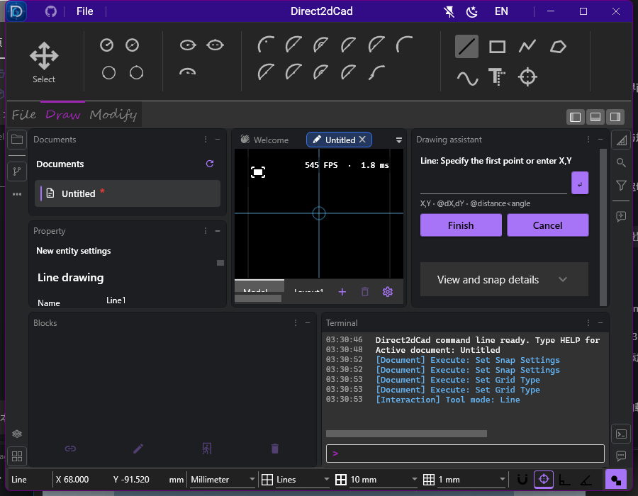

# M1–M3 本机验证 · 2026-10-03

[实施状态](../../M1-M3-STATUS.md) · [操作说明](../../DRAWING-AND-EDITING.md) · [回归摘要 JSON](regression-summary.json) · [响应原始数据](m1-m3-baseline.json) · [样图大小与哈希](samples.json)

代码基线 `041e291287e93429d49f498b5ca571f9a8f12427` 加当前未提交修改。机器 YOIRI，Intel64 Family 6 Model 183 Stepping 1 GenuineIntel，Windows 10.0.26220.0，SDK 10.0.401、运行时 10.0.12。以下数字取每个项目的最终通过结果，不重复累加失败尝试或之前的审查。

后续专项：[画布动态输入](dynamic-input/README.md) · [曲线编辑后显示和选取的索引修复](edit-invalidation/README.md) · [布尔操作与面域](boolean-regions/README.md) · [面域控制点](region-grips/README.md)。专项有独立构建和回归记录，不累加到下方历史完整回归；旧分发包不包含后续改动。

## 最终回归

```powershell
./scripts/testing/Run-Regression.ps1 -IncludeWindowsIntegration -IncludeUiAutomation -ResultsDirectory TestResults/m1-m3-delivery

# 修正输入提交等待，并解决布局设置遮挡视口创建后，复跑受影响的完整项目。
dotnet test Direct2dCad.ViewModels.Tests -c Release --logger trx --results-directory TestResults/m1-m3-vm-final -v quiet
dotnet test Direct2dCad.UiAutomation.Tests -c Release --filter 'FullyQualifiedName!~CadImageAndOleClipboardContentEnterMovablePasteAndCanBePlaced' --logger trx --results-directory TestResults/m1-m3-ui-final -v quiet
```

Release 解决方案构建 **0 警告、0 错误**；覆盖率汇总器自检通过。本次没有采集新的业务覆盖率。

| 项目 | 通过 / 总数 |
| --- | ---: |
| Agent.Codex | 19 / 19 |
| Agent | 7 / 7 |
| AI | 21 / 21 |
| Commands | 74 / 74 |
| Db | 74 / 74 |
| Editor | 65 / 65 |
| HitTesting | 18 / 18 |
| Indexing | 18 / 18 |
| IO | 41 / 41 |
| 跨层 Tests | 96 / 96 |
| ViewModels.Services | 88 / 88 |
| ViewModels | 754 / 754 |
| **托管合计** | **1275 / 1275** |
| Windows/Direct2D 集成 | 130 / 130 |
| 独立 WPF UI 自动化 | 9 / 9 |
| **最终选中用例合计** | **1414 / 1414** |

上述最终结果 0 失败、0 跳过；脚本按既有规则**排除了**会改系统剪贴板的图片/OLE UI 用例，它们不在 9 项之内。首次完整回归的 UI 项目有一项输入提交等待断言失败；复跑发现新增右侧面板使布局设置遮住视口的第二个点击位置。现已等待实际提交状态，并在开始创建视口时自动收起布局设置。修复后复跑整个 ViewModels 和 UI 项目，表中用其最终结果替换原结果，没有将重跑次数累加。原始 TRX 保留在本机 `TestResults/m1-m3-delivery/<项目>/`、`TestResults/m1-m3-vm-final/` 和 `TestResults/m1-m3-ui-final/`，摘要记录每份路径和 SHA256；这些目录按仓库规则不入库。

关键新增证据覆盖精确坐标与独立文件重开、原点测量、完整过滤、文件冲突三种选择、预算与引用拒绝、恢复轮换/关闭生命周期、捕捉候选/嵌套变换、连续工具 Esc、预览纯度、几何退化重试、失败回滚及撤销重做。工具测试执行公共入口，而非只检查 schema。

早期桌面新增流程在 900×700 窗口操作绘图辅助小数坐标的按钮和 Enter，检查面板隐藏/重开保留输入、默认捕捉、状态栏网格类型切换、图标鼠标/空格操作及布局边界、Ribbon 偏移、Esc 和历史。后续已把步骤输入移到画布、移除右侧按钮，当前行为和独立验证见[动态输入专项](dynamic-input/README.md)。旧布局恢复补入新增面板并保持已有面板尺寸；当时新增资源由 MSBuild 自动生成强类型属性，三语言 574 个键一致，界面不显示资源键名。原生验证检查方向实体像素、bounds/命中、打印几何/owner 变换、历史及编辑后的资源；1/1.5/2 倍为**视图 zoom**，不是显示器 DPI。

早期状态栏与绘图辅助的 900×700 截图如下，截图来自独立 UI 测试进程；当前画布小数字框、半透明图标同行及最新 119/119 模型和 10/10 窗口专项见[动态输入记录](dynamic-input/README.md)：



## 响应基线

```powershell
dotnet run -c Release --project Direct2dCad.Benchmarks -- --m1-m3-baseline TestResults/m1-m3-baseline
```

使用固定生成的 mixed 图纸，每种连续测量 3 次，1600×900 离屏 Direct2D。样图二进制保留在输出目录，入库记录其大小、SHA256；生成器可以复现实体分布，文档新 ID 等元数据会使再次生成的文件哈希不同。基线采集于最后一批无效输入和工具箱 UI 修复之前；这些修复不改变基线的 IO、快照查询或原生准备路径。

| 实体数 | 加载中位 ms | 完整准备后首 Present 中位 ms | 保存中位 ms | 独立快照查询中位 ms | owner 调度延迟 P95 中位 ms | 采集取消最大 ms | 进程累计峰值 MiB |
| ---: | ---: | ---: | ---: | ---: | ---: | ---: | ---: |
| 100 | 2.55 | 223.43 | 12.17 | 15.43 | 15.99 | 0.14 | 140 |
| 20000 | 38.07 | 423.99 | 36.75 | 53.87 | 13.54 | 0.09 | 258 |
| 100000 | 125.62 | 1111.01 | 101.61 | 232.76 | 20.19 | 0.06 | 490 |

首 Present 一列从加载完成开始计时，包含创建渲染会话、资源准备、Present 和会话释放，不能与加载耗时或产品窗口首屏混为一项。查询包含 owner 线程的独立快照采集及后台计数。

调度指标来自真实 WPF Dispatcher 的 16 ms heartbeat 延迟，**没有测量鼠标事件到画面更新的实际输入延迟**。P95 会掩盖少数长阻塞：三组 owner 最大延迟分别为 **1006.32 / 639.75 / 1003.57 ms**。100 实体的第一次首 Present 为 1044.99 ms，包含冷启动/JIT/设备成本，其余两次约 223 ms。原始每次数据保留，不只报告中位值。

原生资源准备仍等待完整场景，未测独立渐进首次可见；单次准备不可抢占。取消测量只覆盖协作快照采集。内存为同一基准进程递增的累计峰值，不能当作独立冷进程或每文档常驻内存。上述基线用于 M6 对照，不能据此宣称大图纸交互目标全部达标。

## 未运行的专项

- 实体打印机/PDF 驱动的输出、纸张尺度与取消现场验证；当前通过的是后台结果契约和打印几何转换。
- 100%/150%/200% 混合多屏 DPI、主题/输入法的完整人工走查；桌面自动化仅覆盖指定场景。
- 杀进程后的完整人工恢复演练；独立恢复存储/重开/轮换/生命周期已有自动测试。
- 真实鼠标输入延迟、长期大图纸压力、渐进首屏和不可抢占步骤优化。
- 云端 CI、干净机器安装/升级、签名及发布。本次只新增了托管 CI 配置，未推送或发版。
