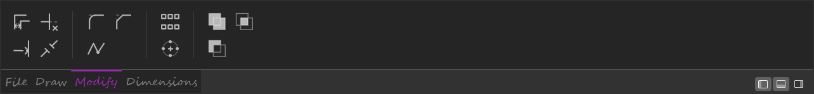
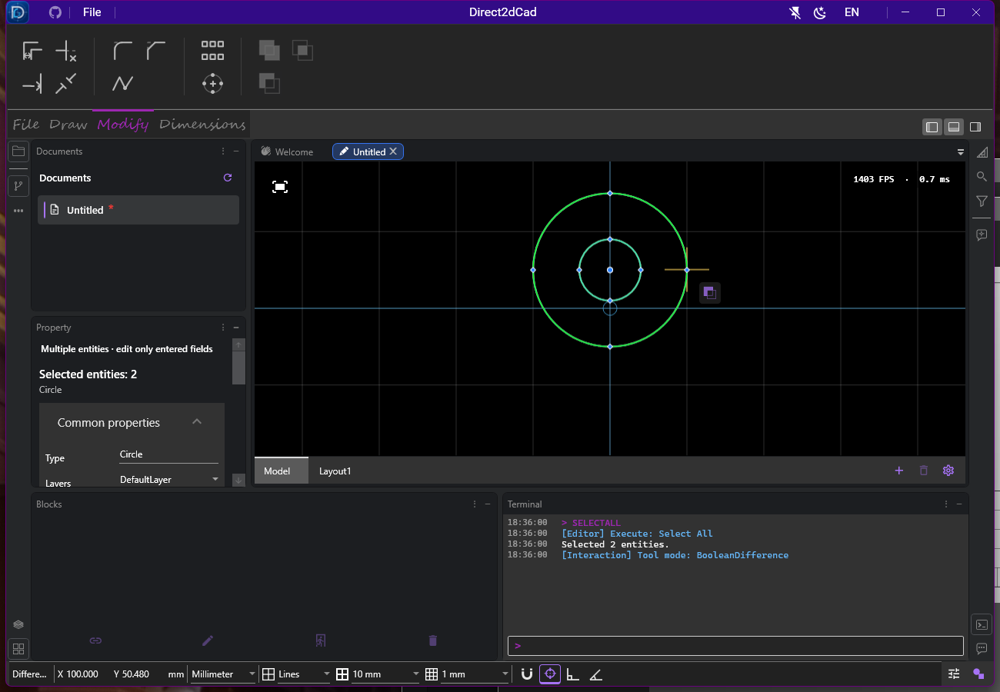
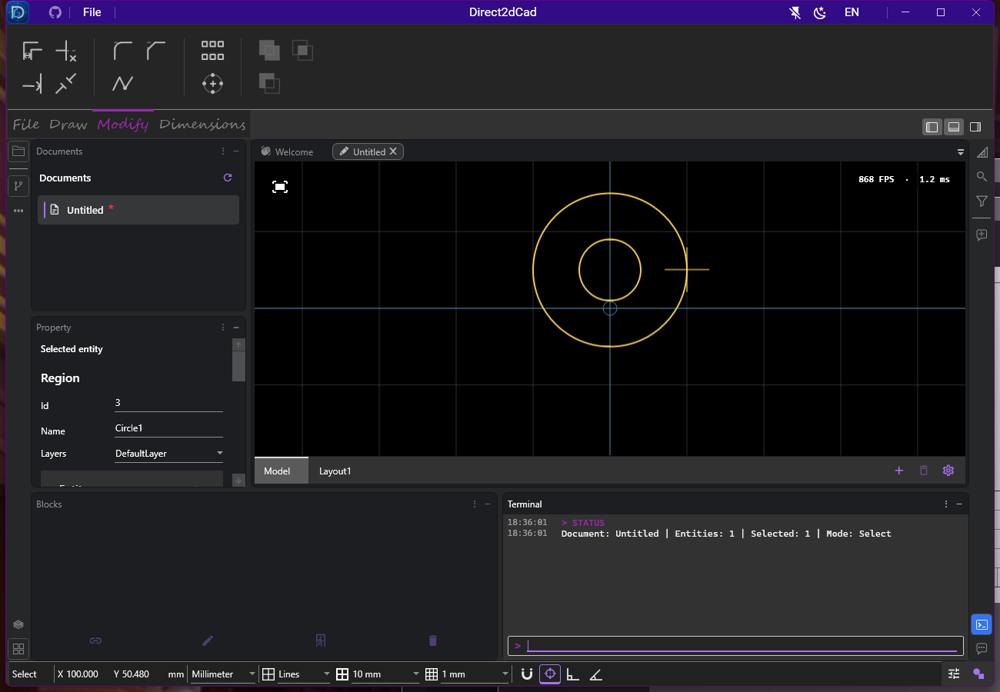

# 布尔操作与面域 · 2026-10-03

[操作说明](../../../DRAWING-AND-EDITING.md#布尔操作与面域) · [交换边界](../../../ANNOTATION-AND-EXCHANGE.md#dxf-支持矩阵) · [验证摘要](verification.json) · [当日验证首页](../README.md)

代码基线 `041e291287e93429d49f498b5ca571f9a8f12427` 加当前未提交修改；Windows 本机，SDK 10.0.401。此记录覆盖当前源码与 Release 构建，旧 M6 ZIP 未重建。源码及证据文件的 SHA256 记录于 JSON，不将历史阶段结果与本次重复累加。

后续已补齐面域中心移动点和四角等比缩放点，见[控制点专项](../region-grips/README.md)。本页构建、测试数字及截图保留布尔功能实现时的记录，不与后续结果重复累加。

## 交互与实现

顶部“修改”页增加并集、交集、差集三个 33×33 图标，颜色和风格沿用现有工具，名称收在悬停提示中；画布右键菜单提供相同入口。未选、单选、不支持的开放实体、只读或不可编辑对象不能开始运算。全部对象须属于当前编辑空间。

差集由用户在画布点选主体，边缘拾取遵循图层显示优先级、实体 ZIndex 和插入顺序，使用原始鼠标位置，不受网格吸附改写。主体和预览有颜色区分；Enter 确认、Esc 取消，结果自动选中，整次操作一次撤销。布尔模式保留光标图标，隐藏无关的动态数字框；详细步骤位于状态栏 tooltip。

计算在文档线程捕获不可变轮廓后转到后台，取消后不再回现预览。提交检查快照是否过期，先完成几何计算，再创建结果和擦除来源；精确的 Created/Deleted 通知更新空间索引和渲染资源。面域使用多轮廓偶奇材料，保留解析直线和圆弧，允许孔洞、分离区域及嵌套岛。

## 最终通过结果

Release WPF 应用构建：**0 警告、0 错误**。下列为七个相关托管项目各自最终结果；最后调整拾取顺序和取消检查后复跑了完整 Db 和 ViewModels 项目，其结果替换早期结果。

| 项目 | 通过 / 总数 |
| --- | ---: |
| Db | 105 / 105 |
| Commands | 86 / 86 |
| HitTesting | 18 / 18 |
| IO | 49 / 49 |
| ViewModels.Services | 91 / 91 |
| ViewModels | 824 / 824 |
| 跨层 Tests | 117 / 117 |
| **相关托管合计** | **1290 / 1290** |
| Windows/Direct2D 布尔与打印几何专项 | 5 / 5 |
| 独立 WPF 窗口布尔流程专项 | 1 / 1 |

所有上述最终结果 0 失败、0 跳过。TRX 分别位于 `TestResults/boolean/managed-final/`、`native/native.trx` 和 `ui/ui.trx`；目录按已有规则不入库，JSON 记录实际路径和哈希。没有运行修改系统剪贴板的无关桌面用例。

托管测试覆盖圆的独立包含谓词随机对照、重合/相切/共边、分离岛、孔洞复用、三层嵌套、多档几何尺度、旋转矩形、自交/开放输入拒绝、预算及取消；命令测试验证准确的实体存活标记、稳定重做 ID、失败不变更、全部轮廓变换、跨文档复制和过期预览拒绝。还验证原生保存重开、快照恢复、块 owner/bounds、孔洞端点及圆心捕捉，以及面域属性和布尔模式 STATUS。

原生渲染四项用例在缩放与执行/撤销/重做状态下，对比真实空间索引路径与不使用索引的完整场景像素，并验证孔洞不填色、嵌套块和实体引用预览。打印几何一项验证 WPF 偶奇填充、孔洞与岛的包含关系；WPF 圆弧内部转 cubic 的面积误差以相对误差 ≤0.001 验证，解析实体面积另由托管测试验证。此项没有提交 PDF 或物理打印作业。

真实窗口一项依次验证顶部按钮在未选/单选时禁用、多选闭合对象时启用，并集取消、差集主体点击与 Enter 确认、面域属性、滚轮缩放、一次撤销重做，以及右键菜单启动交集并提交。截图来自最终自动化运行，窗口 1300×900；这不是多屏 DPI 验收。







## 复验命令

```powershell
dotnet build Direct2dCad.wpf/Direct2dCad.wpf.csproj -c Release --verbosity quiet

foreach ($testProject in @('Direct2dCad.Db.Tests', 'Direct2dCad.Commands.Tests',
  'Direct2dCad.HitTesting.Tests', 'Direct2dCad.IO.Tests', 'Direct2dCad.ViewModels.Services.Tests',
  'Direct2dCad.ViewModels.Tests', 'Direct2dCad.Tests')) {
  dotnet test "$testProject/$testProject.csproj" -c Release `
    --logger "trx;LogFileName=$testProject.trx" `
    --results-directory TestResults/boolean/managed-final --verbosity quiet
  if ($LASTEXITCODE -ne 0) { exit $LASTEXITCODE }
}

dotnet test Direct2dCad.Windows.IntegrationTests/Direct2dCad.Windows.IntegrationTests.csproj `
  -c Release --filter 'FullyQualifiedName~BooleanRegionsMatchIndexedPixels|FullyQualifiedName~RegionPrintIntegrationTests' `
  --logger 'trx;LogFileName=native.trx' --results-directory TestResults/boolean/native --verbosity quiet

$env:DIRECT2DCAD_UI_SCREENSHOT_DIRECTORY = Join-Path (Get-Location) 'docs/validation/2026-10-03/boolean-regions/screenshots'
dotnet test Direct2dCad.UiAutomation.Tests/Direct2dCad.UiAutomation.Tests.csproj `
  -c Release --filter FullyQualifiedName~BooleanRibbonAndContextMenu `
  --logger 'trx;LogFileName=ui.trx' --results-directory TestResults/boolean/ui --verbosity quiet
```

## 当前边界

- 支持圆、全圆圆弧、普通矩形、闭合直线/圆弧路径及已有面域。圆角矩形、椭圆、样条、开放曲线不支持；不自动折线化。输入最多 2048 条边，排列/结果最多 32768 条边，容差不足或无法闭合的结果拒绝提交。
- 空结果保留原对象，提示后可取消；面域不提供逐顶点拉伸，不接入单条曲线的修剪/打断/偏移。整体变换、样式/填充、选择、捕捉、复制、原生存储与打印几何已接通；整体移动和缩放的控制点另见后续专项。
- 面域 DXF 转换尚未实现；导出分析列出该类实体，未确认有损导出时不写文件。原生图纸只在含面域时增加新的 section，旧版按已有未知 section 策略只读保护。
- 未做完整人工制图验收、混合多屏 DPI、长期大型布尔压力、实体打印机/PDF 输出或全解决方案回归；未重建分发包、签名、推送、运行云端 CI 或发布。
