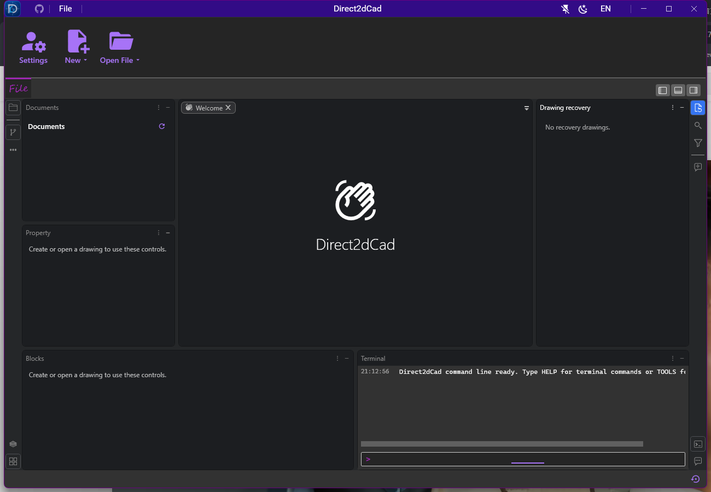
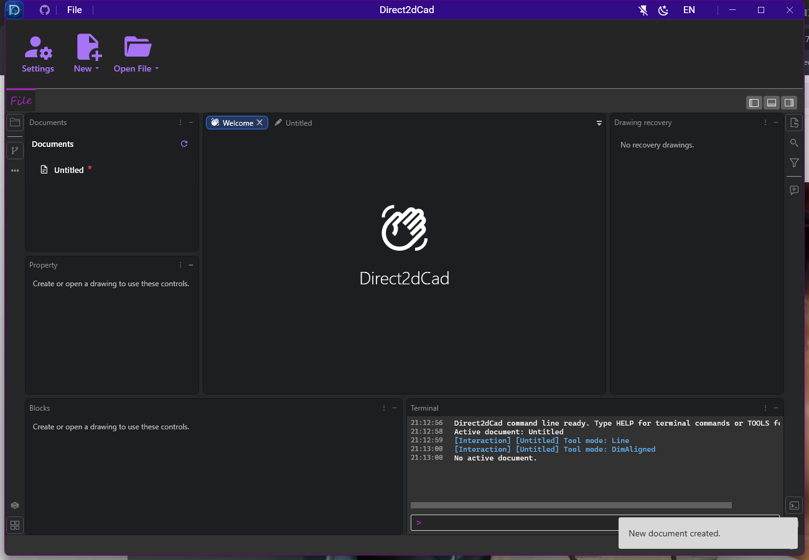
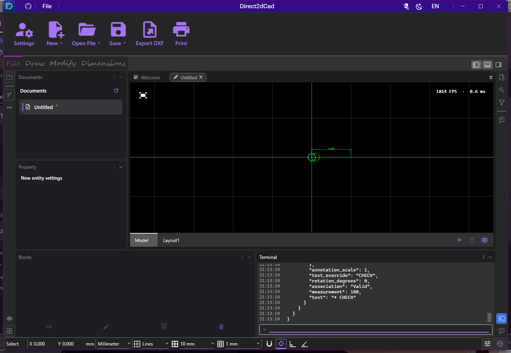

# 欢迎页与命令覆盖验证

[接口和使用示例](../../../COMMANDS-AND-AI.md) · [运行时目录](command-catalog.json) · [验证摘要](verification.json)

日期：2026-10-03，Windows / .NET SDK 10.0.401，Release。

| 检查 | 最终结果 |
| --- | --- |
| 解决方案 Release 构建 | 通过，0 警告 / 0 错误 |
| ViewModels 相关回归 | 200 / 200 |
| Agent 协议回归 | 7 / 7 |
| Codex 适配器回归 | 19 / 19 |
| 真实窗口专项 | 4 / 4 |
| 欢迎页 / 图纸 / 工具箱切换绑定跟踪 | 0 warning / error，日志为空 |

最终用例按独立 TRX 统计；专项重复运行与修复期间的失败不累加。原始最终 TRX 位于仓库的 `TestResults/command-coverage`，摘要和源码 SHA-256 保存在 `verification.json`。此处的 226 项托管检查是本次选定的相关回归，不是整个仓库的测试总数。

覆盖的关键行为：

- 欢迎页隐藏 Draw / Modify / Dimensions，切回图纸恢复；已有属性上下文与空恢复列表行为保持。
- HELP 可发现简写；真实 Terminal 执行并集、移动、撤销、创建/编辑/解除标注关联及精确读回。检查文档命令实际进入历史列表，而不仅查看最后返回值。
- Terminal 批量输出仍自动跟随；用户向上滚动后保留当前位置，点击跟随按钮恢复。
- 三种布尔结果、撤销/重做、空结果/锁定/缺少主体/预先及计算中取消；失败不删除源实体或增加修改历史。
- 标注创建和详细样式修改、关联保持、解除与撤销、非法字段和数值不产生修改。
- 变换简写按英寸显示单位换算为毫米，复制保持选择后备和剪贴板别名。
- 新工具的 schema、上下文筛选和 8192 预算保留；AI 查询、错误、取消及非活动图纸日志。

UI 自动化明确恢复键盘焦点、使用物理 DPI 坐标、在原有截止时间内重试临时 UIA COM 快照失败，并滚动到历史项后检查。检查条件仍要求命令已执行、历史记录存在、欢迎页属性已清空以及页签恢复。

没有连接真实 LM Studio 模型或在线 Codex 会话；这些结果验证本机工具/协议和窗口行为，不证明模型的自然语言理解、多轮规划或所有显示器配置。命令目录数量为 42 个基础命令、8 个新增操作简写、89 个共享工具，功能存在重叠，别名不重复计数。

