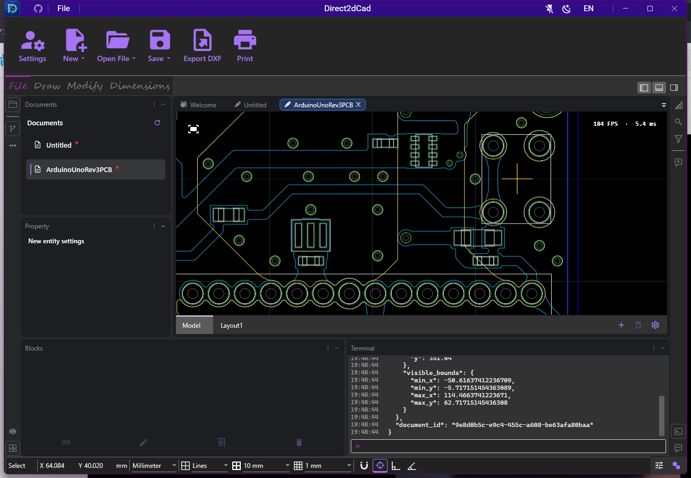

# Arduino PCB 局部缩放 · 2026-10-03

[性能说明](../../../PERFORMANCE.md) · [验证摘要](verification.json) · [真实窗口滚轮记录](ui-wheel.json) · [轮廓像素记录](stroke-pixels.json)

用户在 Arduino PCB 右侧连接器附近放大时看到二十多帧。本次读取原始 `ArduinoUnoRev3PCB.dxf`，按毫米导入，在相同区域 `(64, 40)` mm 复现并修复。源文件只读，SHA256 为 `3354C72BFCEF80571DBB617D95D889780232557EFECB718EF73D48B769106891`。

## 原因与实现

导入后有 1,681 个实体：717 条多段线、793 条复合路径和 171 个圆。其中两条多段线各有 3,530 / 3,718 个顶点，bounds 覆盖大半块 PCB。实体空间索引只排除整个实体；局部放大时这些轮廓仍整条提交给 Direct2D。可见实体从 1,681 降到 16，完整绘制却从约 15 ms 升到约 75 ms。逐类和逐实体排除测量指向这些长轮廓，关闭网格没有消除问题。仅关闭 geometry realization 后仍有约 60 ms 的高倍绘制，说明不能只关闭缓存。

屏幕恒定线宽还使描边 realization 在连续缩放中频繁重建。单次原生创建约 12–13 ms，虽然批次预算为 2 ms，但进入一次不可抢占的原生调用后不能按预算终止。

现在，512 个顶点以上的实线多段线按视野构建临时描边 geometry，只省略整条位于安全范围外的边。保留原坐标、连续段、闭合接缝处的 join，并使用 64 像素余量、miter/cap 范围和浮点坐标余量，让人为产生的开放端点留在视野之外。没有改动文档实体、空间索引或几何精度；填充仍使用完整闭合路径。

长实线轮廓不再录入覆盖全路径的可复用 command list，正常绘制和原位选择高亮都使用相同的可见描边逻辑；长路径的屏幕恒定描边不再在每个缩放刻度创建 realization。虚线、自定义线型、LOD 简化 geometry、command-list 录制和变换块保留完整路径，保护 dash phase 和局部坐标。虚线保留可复用 command list。

## 测量与边界

使用本机硬件 Direct2D，`UsingWarp=false`。离屏画布 516×384，与用户截图近似；完整重绘，3 次重复，每次 32 个 ×1.1 放大和 32 个 ÷1.1 缩小刻度，默认模式共 192 帧。计时包含真实 host 绘制、EndDraw 和 Present 回调；不包含 WPF 输入和合成延迟，也不是显示器实际刷新 FPS。

前后完整记录位于 `TestResults/dxf-zoom/before/zoom.json` 和 `after-final/zoom.json`，[摘要](verification.json)保存原始文件哈希、逐模式结果及代表帧，[CSV](measurements.csv)归档所有模式的 1,152 行前后测量。中位和 P95 读取默认模式；其他诊断模式单独记录。

| 默认模式，完整绘制 | 修复前 ms | 修复后 ms |
| --- | ---: | ---: |
| 192 帧中位 | 43.42 | 2.76 |
| P95 | 69.26 | 8.92 |
| 最大值 | 74.70 | 21.12 |
| 第一次最高放大档，可见 16 个实体 | 74.70 | 1.33 |

早一轮 `after/zoom.json` 在关闭 realizations 的诊断模式出现单帧约 96.5 ms 的 CPU 提交尖峰；最后一次该模式最大值为 17.45 ms。两次原始记录均保留，未据此声称所有配置每帧均低于 16.7 ms。

当前导入器仍报告 **10,611 条 Wide polyline 不支持**。前后测量使用同一导入结果，这不是整份原始 DXF 全部内容的性能或兼容性验收。

真实 WPF 应用还通过鼠标滚轮在该连接器附近放大 32 次、缩小 32 次，并验证长轮廓选择高亮和重新拟合。实际画布为 924×383；最终下图界面显示 184 FPS / 5.4 ms，这是滚动窗口内绘制耗时的估算，不是物理刷新率。UIA 在同一刻度稍早读取到 182 FPS / 5.5 ms，两个时刻的滚动平均可能不同。



## 正确性检查

- Release 整套解决方案构建 0 警告、0 错误；原生渲染、缓存及本次可见描边专项 138/138 通过，真实窗口专项 1/1 通过。最终结果见摘要，不与其他日期或阶段的数量累加。
- 48 组原生像素严格一致对照，覆盖开放/闭合接缝、4 类端帽和 join、不同缩放/线宽、半透明笔刷；另外验证包围视野但轮廓全在外面的路径不会提交描边。
- 真实 DXF 的 7 条长轮廓：64 个缩放刻度和 3 次平移，469 次独立轮廓对照；442 次逐像素一致，其余每条最多 8 个像素变化，最大颜色通道差 16/255。测试上限为 16 个像素和 32/255，限制 Direct2D 拐角抗锯齿取整的差异，不宣称整幅叠加画面逐位相同。
- 虚线/录制坐标回退、长路径不重复创建描边 realization、既有编辑/撤销/缓存/选择回归以及 1 项真实窗口专项。

一次并发原生回归中，既有面域像素用例出现单通道 15/16 的差异；独立复测 4 个面域用例通过。新增数百次 GPU 捕获用例改为不可并行的测试 collection，避免与有时间预算的缓存用例竞争。原始失败与复测 TRX 都保留，不把复测作为额外通过数量。

## 复验

```powershell
dotnet run -c Release --project Direct2dCad.Benchmarks -- `
  --dxf-zoom 'C:\Users\yoiri\Downloads\ArduinoUnoRev3PCB.dxf' TestResults/dxf-zoom/recheck

$env:DIRECT2DCAD_UI_DXF_SAMPLE = 'C:\Users\yoiri\Downloads\ArduinoUnoRev3PCB.dxf'
$env:DIRECT2DCAD_NATIVE_DXF_TRACE = Join-Path (Get-Location) 'TestResults/dxf-zoom/pixels'
dotnet test Direct2dCad.Windows.IntegrationTests -c Release `
  --filter 'FullyQualifiedName~VisiblePolylineStrokeIntegrationTests|FullyQualifiedName~Direct2DRenderHostIntegrationTests|FullyQualifiedName~Direct2DCacheUpdateTests'

$env:DIRECT2DCAD_UI_SCREENSHOT_DIRECTORY = Join-Path (Get-Location) 'TestResults/dxf-zoom/ui'
dotnet test Direct2dCad.UiAutomation.Tests -c Release --filter FullyQualifiedName~SuppliedDxfRemainsVisible
```

外部样本测试在未设置环境变量时跳过，CI 不依赖用户 Downloads。可设 `CAD_DXF_ZOOM_DIAGNOSTIC=1` 复验背景/类型排除和最长轮廓单独绘制；诊断同样记录原始帧。未测长期压力、多屏 DPI、物理输入到显示延迟、不同 GPU 或显示器刷新率；未重打包、签名或发布。
