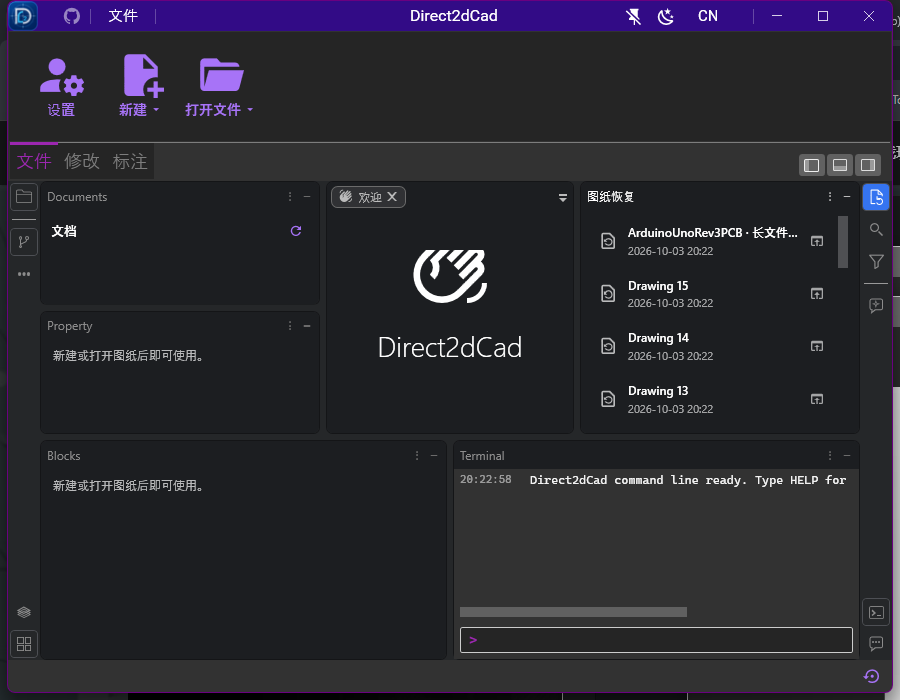
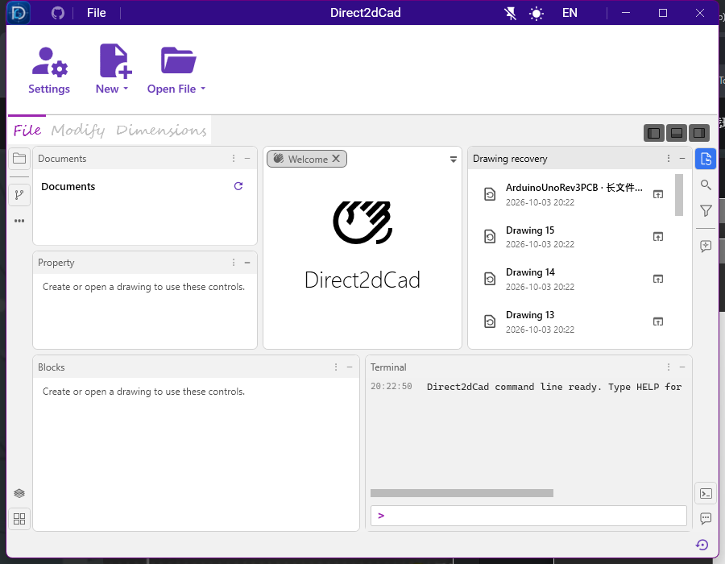

# 图纸恢复工具箱与 WPF 绑定验证

2026-10-03，Windows，Release。本次仅调整恢复工具箱及已发现的 UI 绑定问题。

## 界面

- 显示名称改为“图纸恢复”，同步更新中、英、日文和侧边栏图标。保留原工具箱 ID、布局设置和 Ctrl+Shift+D 快捷键。
- 移除 Expander 和重复的大按钮。恢复列表直接显示，整行可点击；名称单行省略，时间单独显示，悬停显示完整名称和源路径。
- 支持垂直滚动、键盘焦点和空格打开。无恢复条目时只显示简短空状态；状态栏保留一个恢复入口。
- 修正其他工具箱在欢迎页显示“绘图辅助”的错误提示。恢复操作继续创建独立身份、无普通保存目标的图纸副本。

## 绑定问题

真实窗口日志确认并修复了以下问题：

1. Ribbon 图标按钮的 ToolTip 初始化为空时，AutomationProperties.Name 接收到 null。添加 TargetNullValue 空字符串，正常提示更新后仍提供有意义的无障碍名称。基线有 22 条错误。
2. 停靠按钮在主题重建期间失去视觉父级，ButtonSize 的 FindAncestor 绑定失败。改为通过按钮自己的 Anchorable 模型找到所属 manager，并在应用和 manager 资源中保持稳定样式。主题切换基线有 40 条警告。
3. 工具箱 TabItem 在重建期间找不到 TabControl。单标签隐藏条件改为读取模型的 Parent.Children.Count；脱离视觉树时仍可响应标签数量更新。

保留 Arc 的模板与动态主题颜色。没有降低诊断等级来屏蔽错误。可通过 `DIRECT2DCAD_BINDING_TRACE_PATH` 启用真实应用的 Warning/Error 日志；无此环境变量时不创建日志。独立探针测试确认，在不附加调试器的情况下，真实错误绑定能够被记录。

## 验证结果

- Release 解决方案构建：0 warning、0 error；git diff --check 通过。
- ViewModel：10/10；WPF 集成：6/6；真实窗口 UI：9/9。
- 9 个真实应用绑定日志均为 0 warning、0 error。
- 隔离恢复目录包含 16 张有效图纸，验证长名称、完整路径提示、滚动到最后一项及键盘恢复。打开后核对完整恢复名称、活动图纸状态、空保存路径，原恢复文件仍存在。
- 覆盖欢迎页与绘图页切换、绘图和修改 Ribbon、动态输入、标注属性与撤销重做、网格与捕捉、多选属性及图层锁定冻结、设置保存与实时主题切换。
- 检查 900×700 和 1300×900 窗口；视觉检查中文深色与英文浅色截图。

这些结果代表列出的界面路径，未穷举所有对话框和浮动窗口操作。未执行发布或打包。

详细用例结果、源码哈希和日志清单见 [verification.json](verification.json)，逐路径检查见 [binding-audit.csv](binding-audit.csv)。原始 TRX 和日志保存在仓库本地 `TestResults/recovery-ui`；修复前日志保存在本目录的两个 `*-before.txt` 文件。

