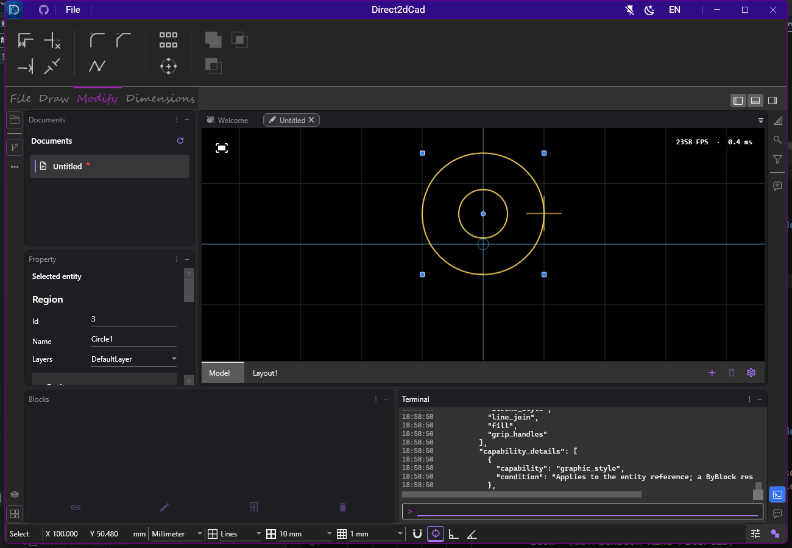
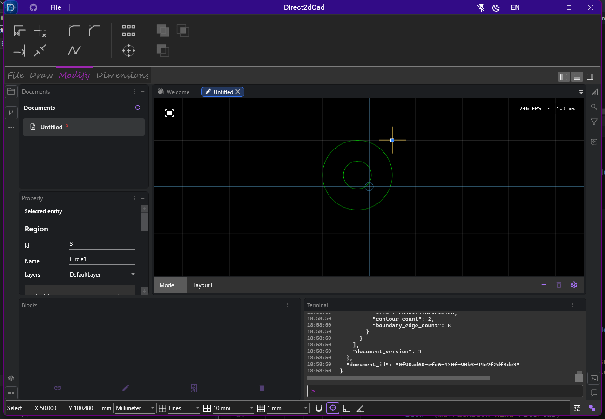

# 面域控制点 · 2026-10-03

[操作说明](../../../DRAWING-AND-EDITING.md#布尔操作与面域) · [布尔操作实现记录](../boolean-regions/README.md) · [验证摘要](verification.json)

布尔结果是 `CadRegion`，初次实现接通了整体变换，但没有声明控制点能力，也没有生成面域的控制点。本次补入一个圆形中心移动点和四个方形外框角点，并接通角点的等比缩放预览、活动控制点位置和提交路径；中心点复用现有的整组移动机制。

点击控制点后移动鼠标，再点击目标位置提交；松开鼠标继续预览，Esc 取消。四角围绕对角等比缩放，所有轮廓、孔洞和岛一起变换，解析圆弧保持圆弧。中心点即使落在孔洞或岛之间仍可拾取，多选时一起移动可编辑实体。锁定图层的面域不显示控制点，拖动期间变为锁定也不能提交。操作各占一次撤销记录。

## 本机验证

Windows，SDK 10.0.401，基线 `041e291287e93429d49f498b5ca571f9a8f12427` 加未提交修改。Release WPF 应用构建 **0 警告、0 错误**。

| 专项 | 通过 / 总数 |
| --- | ---: |
| 新面域控制点与既有控制点交互契约 | 105 / 105 |
| 实体能力矩阵 | 14 / 14 |
| 控制点场景构建、复用与更新 | 12 / 12 |
| **托管专项合计** | **131 / 131** |
| 真实 WPF 窗口移动、缩放 | 2 / 2 |

最终结果 0 失败、0 跳过，不与前一轮布尔功能回归重复累加。TRX 位于 `TestResults/region-grips/managed/` 和 `ui/ui.trx`，JSON 记录原始文件及关键源码 SHA256。

新增托管测试覆盖五个控制点各自的预览纯度、提交、一次撤销重做，以及圆弧、孔洞、岛、面积和轮廓数的保持；还通过真实 ViewModel 鼠标路径验证中心/角点的预览、Esc 和点击提交，检查锁定后提交拒绝与多选整体移动。撤销重做使用几何容差对照轮廓，不要求等价圆弧起角的内部表示逐位相同。

两项窗口测试分别验证移动与等比缩放：创建含孔洞的布尔结果，点击实际控制点、预览、取消，再重新点击并提交；通过公开实体查询独立核对前后 bounds，检查一次撤销及重做。已查看最终截图，确认中心和四角控制点可见，缩放预览与移动结果均保留孔洞。窗口为 1300×900，此证据不代表混合多屏 DPI 验收。





## 复验命令

```powershell
dotnet build Direct2dCad.wpf/Direct2dCad.wpf.csproj -c Release --verbosity quiet
dotnet test Direct2dCad.ViewModels.Tests/Direct2dCad.ViewModels.Tests.csproj -c Release `
  --filter 'FullyQualifiedName~RegionGripWorkflowTests|FullyQualifiedName~GripWorkflowContractTests' `
  --logger 'trx;LogFileName=grips.trx' --results-directory TestResults/region-grips/managed --verbosity quiet
dotnet test Direct2dCad.Db.Tests/Direct2dCad.Db.Tests.csproj -c Release `
  --filter 'FullyQualifiedName~CadEntityCapabilityMatrixTests' `
  --logger 'trx;LogFileName=capabilities.trx' --results-directory TestResults/region-grips/managed --verbosity quiet
dotnet test Direct2dCad.Tests/Direct2dCad.Tests.csproj -c Release `
  --filter 'FullyQualifiedName~CadHandleScene' `
  --logger 'trx;LogFileName=handles.trx' --results-directory TestResults/region-grips/managed --verbosity quiet
$env:DIRECT2DCAD_UI_SCREENSHOT_DIRECTORY = Join-Path (Get-Location) 'docs/validation/2026-10-03/region-grips/screenshots'
dotnet test Direct2dCad.UiAutomation.Tests/Direct2dCad.UiAutomation.Tests.csproj -c Release `
  --filter 'FullyQualifiedName~BooleanRegionGrips' `
  --logger 'trx;LogFileName=ui.trx' --results-directory TestResults/region-grips/ui --verbosity quiet
```

当前控制点用于整体移动和等比缩放，不提供逐顶点拉伸。未重新运行全解决方案回归、长期压力或多屏 DPI 人工验收；未改存储/布尔内核，也未重建分发包、签名、推送或发布。
