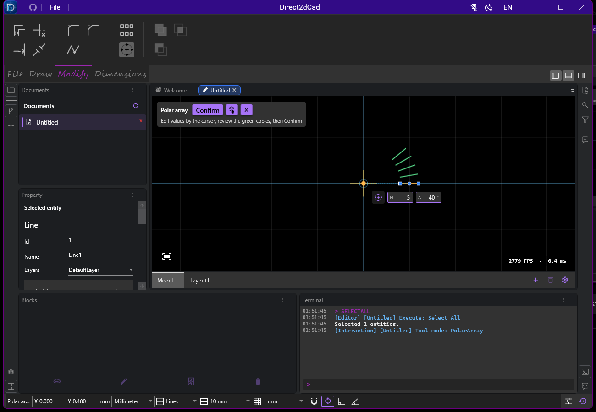
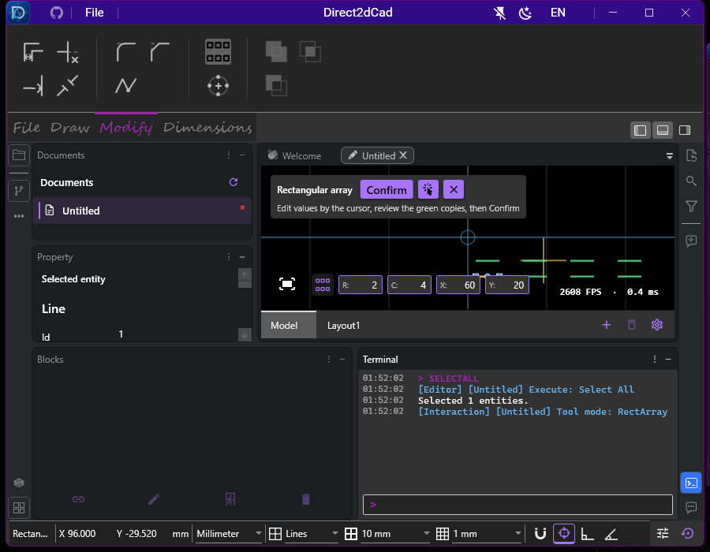
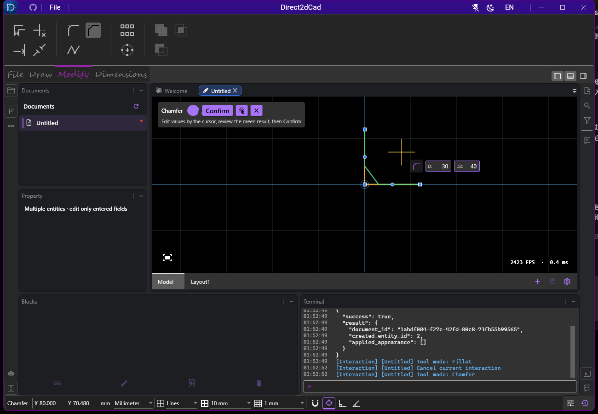
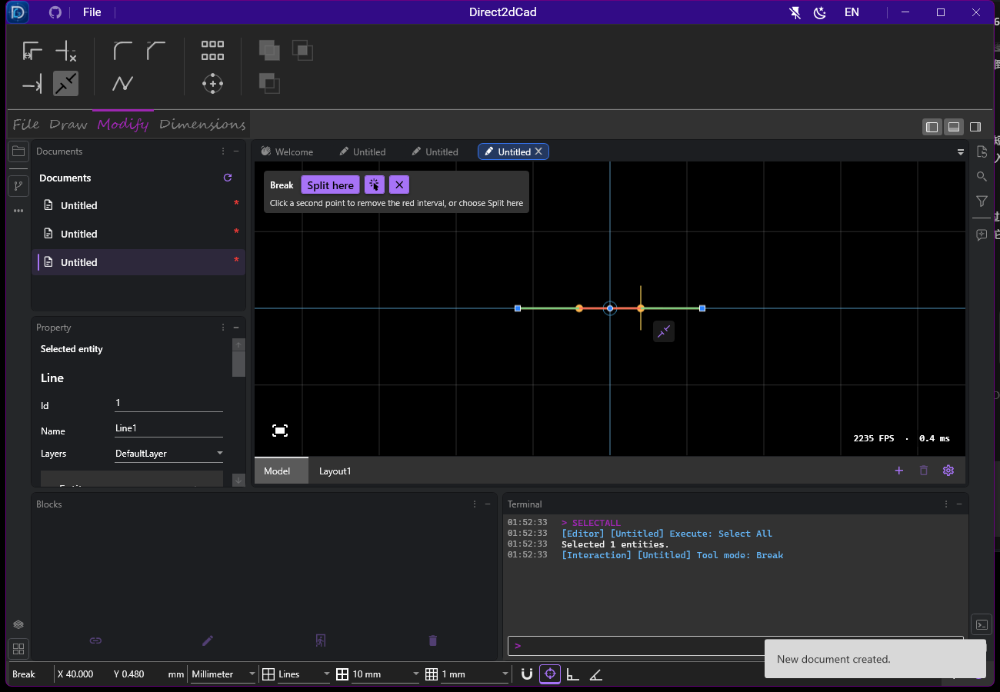
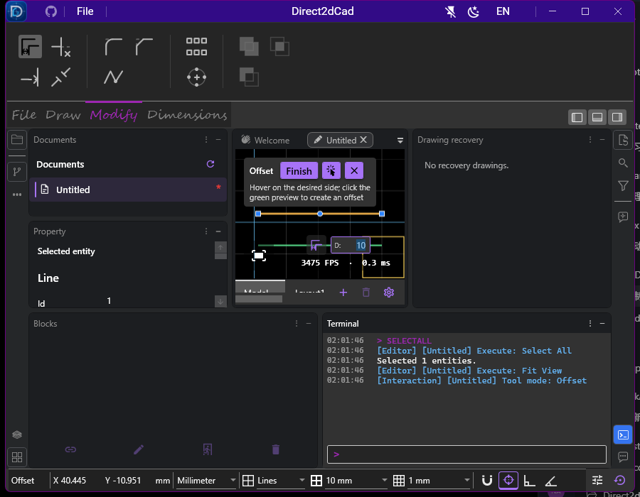

# 修改工具的光标输入与预览验证

本记录是光标输入的首版快照。后续的鼠标偏移距离、移除操作按钮、阵列两次点击完成及圆角预览保留，见[鼠标与键盘交互验证](../edit-mouse/README.md)。

2026-10-04，在 Windows x64 的真实 WPF / Direct2D 窗口完成专项验证。参数从属性面板移到光标旁，顶部仅保留工具名、简短步骤提示和操作按钮。

环形阵列只有 `N:` 数量、`A:` 总角度；矩形阵列是 `R:` 行、`C:` 列、`X:` / `Y:` 间距。偏移、圆角、倒角使用同样的短框。支持鼠标输入、直接键入数字、Tab / Shift+Tab 切换；模式图标位于同一行左侧，边缘避让不遮住点击位置。参数变化实时预览，编辑字段不会提前选定阵列中心或提交实体。

## 结果

| 检查 | 结果 |
| --- | --- |
| Release 构建（UI 测试项目引用实际应用） | 通过，0 警告、0 错误 |
| 模型专项 | 73 / 73 通过 |
| 不同 UI 专项用例 | 10 项均通过 |
| 绑定日志 | 9 份为空，未记录绑定错误 |
| 三语言资源 | 每份 659 个键，无重复 |

UI 结果由一次 10 项运行中的 9 项通过，以及窄窗口用例修正后的单项通过组成；不是声称单轮 10 / 10。主轮后仅修改测试定位，没有修改产品。原用例只查找绘图字段 ID，且恢复面板打开后图形位于缩小画布之外；修正为查找修改字段，并先用“适合窗口”定位，再检查绿色预览、点击提交、实体数量和撤销。具体结果、TRX 路径及哈希记录在 [verification.json](verification.json)。

## 覆盖

- 偏移：键入距离，实际绿色预览刷新；非法文本阻止确认和画布提交，修正后创建与撤销。
- 圆角、倒角：第一条曲线选中后，悬停第二条即可预览；参数输入和取消、确认可用。
- 矩形阵列：900 × 700 窗口中四个短框保持同一行且不裁剪，Tab 输入四个参数；零行拒绝，修正后生成完整阵列并撤销。
- 环形阵列：仅两项输入，数量 5、总角度 40° 可用 Tab / Shift+Tab 输入；中心未确定前已有预览，字段 Enter 不提前选中心，确认生成 5 个实体并撤销。
- 修剪、延伸、打断、连接：实际鼠标和阶段按钮流程，红色删除区间、绿色新增或连接预览，第一打断点标记，确认和撤销。
- 工具切换、重新选择：可见非法输入不能提交；重新选择保留数值。
- 原三点圆、圆弧、椭圆弧动态输入及窄窗口状态栏操作回归。

模型额外覆盖预览不写历史、文档参数变化、离开画布仍保留预览、整数与非有限文本、捕捉后的断点、预选高亮和阵列预览预算。

## 修复与边界

真实窗口检查发现并修复了实体引用缓存忽略预览颜色、变换阵列按源位置裁剪、参数条与辅助按钮重叠、帧率文字拦截点击等问题。光标输入接入后，修改点击不再清空参数锁定或非法文本；输入使用字符串模型，避免数值转换绑定错误。失败记录仍保留在本地 TestResults 中。

阵列预览最多显示前 256 个位置，超过时显示说明；确认仍生成完整阵列，保留 10000 实体预算。各工具的几何支持范围保持既有边界。不支持的对象或参数会显示原因并保留步骤。

本次未运行整产品回归、混合 DPI 和所有语言的视觉验收，也未测输入延迟。未更新发布包、安装器或签名。

## 截图

其他工具截图同目录保存，均检查过实际显示。
