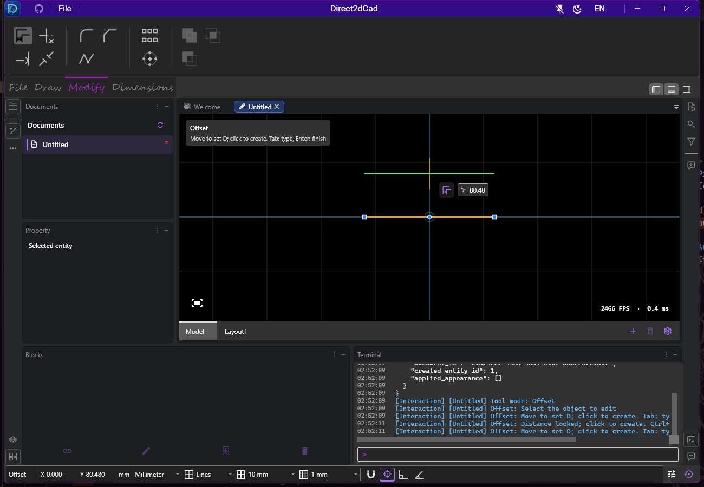
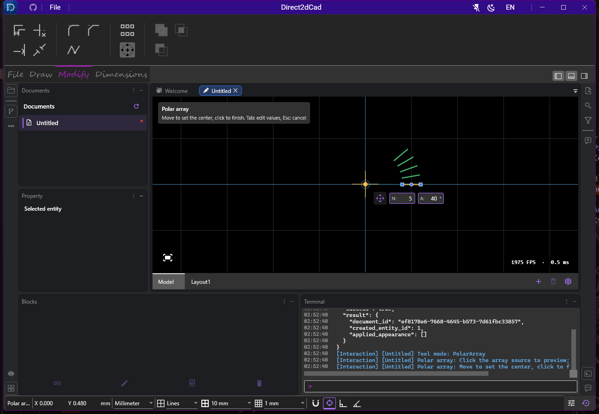
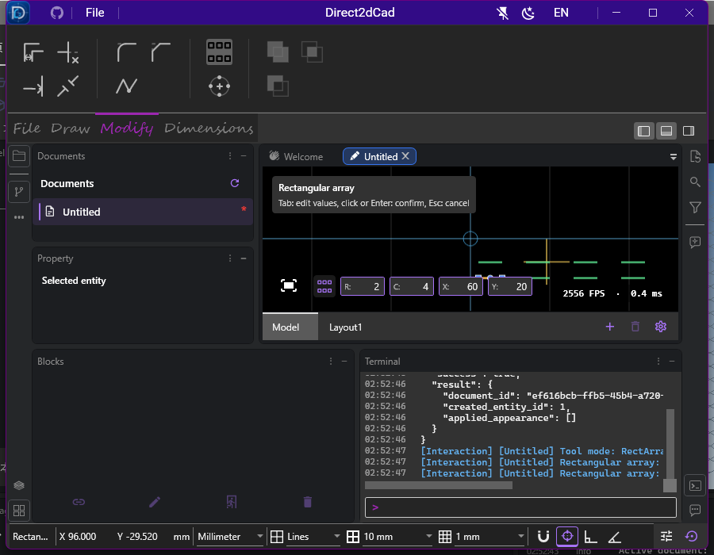
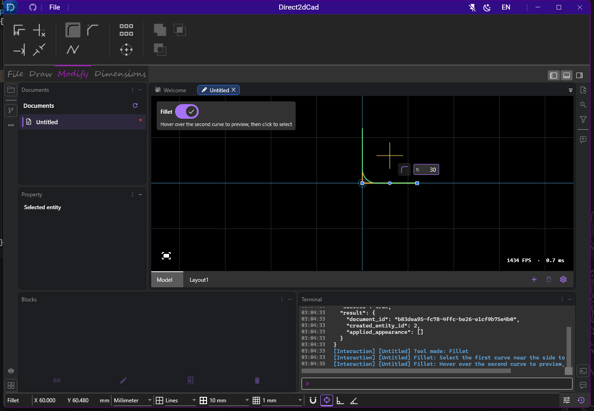
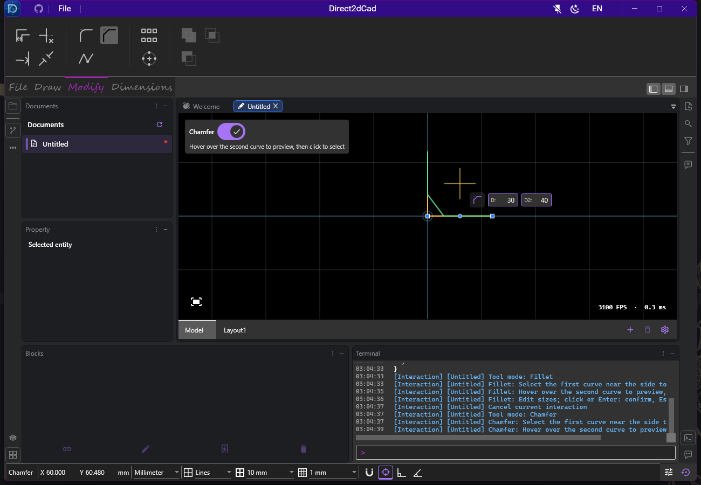
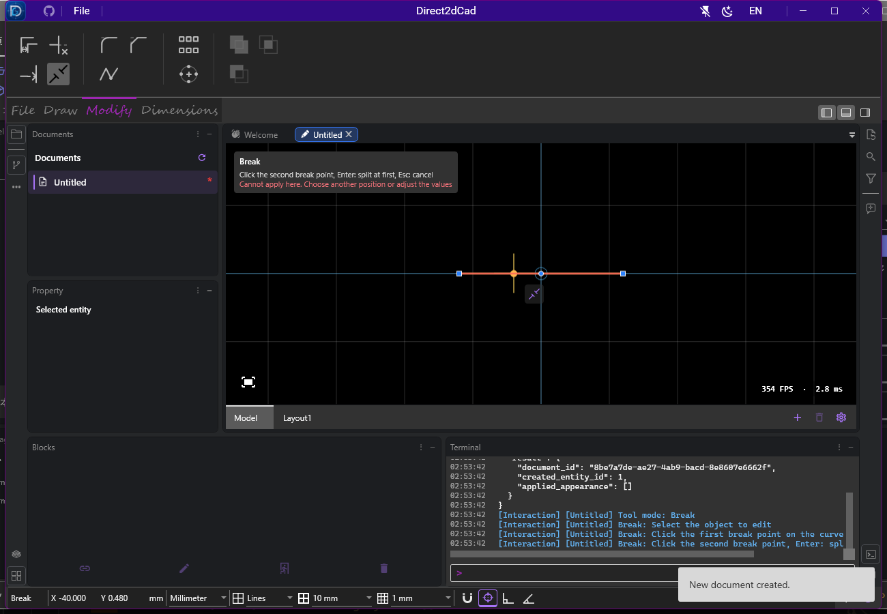
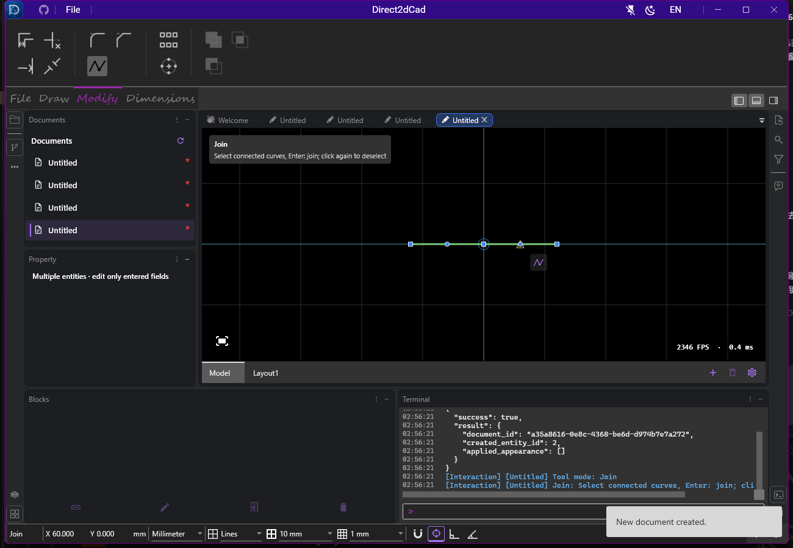

# 修改工具的鼠标距离与键盘交互验证

2026-10-04，在 Windows x64 的实际 WPF / Direct2D 窗口验证。左上角保留工具名和简短提示，提示同时写入 Terminal；下一步 / 确认、重新选择和取消三个按钮已移除。

## 当前操作

- 偏移：选源对象后，D 根据鼠标到曲线的垂直或径向距离更新，绿色预览跟随距离和方向；输入 D 后锁定距离，`Ctrl+Delete` 恢复鼠标跟随。左键创建，`Enter` 结束，`Esc` 取消。
- 矩形阵列：第一次点击实体即预览，`Tab` 修改行列和 X/Y 间距，第二次点击画布完成。多选对象可先预选，无下一步或确认按钮。
- 环形阵列：第一次点击实体即预览，中心跟随鼠标；`Tab` 修改数量 / 总角度，第二次点击确定中心并完成。字段内 `Enter` 仅接受输入，不生成实体。
- 连接：点选链段后 `Enter` 连接。打断：点选源对象和首点后，第二点左键移除区间，或 `Enter` 仅在首点分割；首点标记和删除预览保留。
- 圆角 / 倒角：鼠标碰到第二条曲线后保留候选预览，移开鼠标或修改尺寸仍显示；碰到其他候选时更新，重新选择或取消时清除。点选第二条的保留侧后，左键或 `Enter` 确认。
- 画布上的 `R` 重新选择对象，保留手动数值。画布禁用输入法组合输入，避免截获字母快捷键；数值框和其他文字控件保留自己的输入行为。
- 进入模式、操作阶段变化时打印当前提示；相同提示不会随鼠标移动和每帧预览反复打印。

## 验证结果

| 检查 | 结果 |
| --- | --- |
| Release 构建 | 通过，0 警告、0 错误 |
| 模型与命令行专项 | 93 / 93 通过 |
| 不同真实 UI 用例 | 9 项均有通过记录，含失败项重跑 |
| WPF 绑定日志 | 8 份为空 |
| 三语言资源 | 每份 662 个唯一键，无重复 |
| git diff --check | 通过 |

UI 主轮为 8 项中的 6 项通过。偏移非法输入修正及两点打断预览在保留原几何、提交、撤销要求的重跑中通过；另有一项绘图动态输入回归通过。不能将这些记录描述为单轮 9 / 9。主轮之后补充测试诊断并等待实际键盘焦点、通过向下键打开新建菜单。随后保留本地裁剪选项尺寸调整，并针对最终 XAML 补跑圆角 / 倒角用例，结果通过；verification.json 记录最终源码及应用哈希。

前期检查修复了画布输入法截获 `R` 的实际事件路径。鼠标数值检查还处理了 WPF 原点的亚像素位置：实际 D 为 50.48，而非 UIA 整数矩形推算的 50；后续断言按实际鼠标位移核对数值，并检查真实绿色预览。Terminal 提示属于活动列表，测试同时读取可见记录，不将其误当作最新命令返回值。重新选择后仍可有黄色捕捉标记，测试检查绿色编辑结果被清除。未成功的 TRX 和诊断截图保留在本地 TestResults。

模型覆盖鼠标两侧的偏移距离、端点外的法向距离、圆的径向距离、锁定 / 解锁、非法文字、零距离结束、阵列第一点击预览 / 第二点击生成、预览不写历史、撤销、圆角候选保留，以及 Terminal 阶段提示不刷屏。真实 UI 检查含 Tab、Shift+Tab、Enter、Esc、R、Ctrl+Delete、900 × 700 窄窗口，以及原绘图数值输入和圆的精确创建 / 撤销。

运行结果、源码和截图哈希保存在 [verification.json](verification.json)。本轮没有运行整产品回归、混合 DPI 或所有语言的视觉验收，也没有性能测量或更新发布包、安装器、签名。

## 截图

